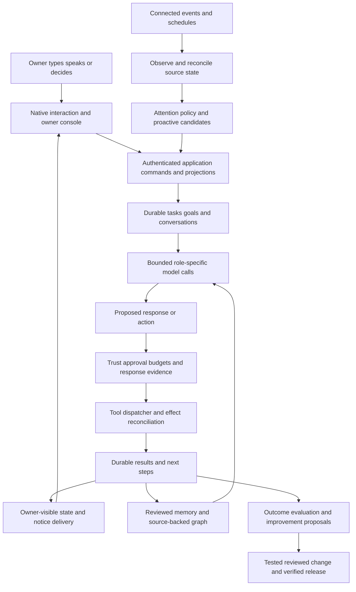

# Assistant architecture and implementation review

Reviewed October 2, 2026; continued implementation October 3. This is the integrated review and implementation record for the product, engineering, design, performance, model strategy, and improvement loop. Companion reports inspect every retained web route and every reachable native destination and supporting flow:

- [Web: all 34 routes, current availability, visual/behavior checks](audits/web-experience-2026-10-02.md)
- [Native: primary pages, sheets, editors, voice and system surfaces](audits/ios-experience-2026-10-02.md)
- [Agent: durability, context, initiative and improvement](audits/agent-architecture-2026-10-02.md)
- [Design system and guidelines](design-system.md)
- [OpenRouter models, prices and repeatable evaluation](model-evaluation.md)
- [Durable pulse admission and privacy transaction](durable-pulse-admission.md)
- [Native map preparation and remaining performance work](../apps/ios/docs/graph-performance.md)
- [Session ownership, drafts and interface simplification](ui-simplification-2026-10-03.md)

## Judgment

The strongest route to an excellent personal assistant is to improve continuity, follow-through, evidence, attention, and native interaction around the existing durable system. This repository already has the right major ingredients: shared application use cases, durable execution, approval and trust policies, provenance-bearing memory, tool-result evidence, typed storage ports, bounded repair work, and a native client.

Its weaknesses are mostly seams: independent proactive producers do not share a complete attention contract; context limits are distributed across features; some screens confuse failed reads with emptiness; broad client state can invalidate unrelated UI; and model choices are supported by catalog metadata more than outcome-level evidence. The continuation closes the pulse claim-before-message gap in both adapters. A larger model or more agents will not repair the remaining seams by itself.

The everyday product is currently native-first. The browser is intentionally an owner administration/audit console; 27 retained product routes redirect to Settings. Documentation now makes this explicit. Turning dormant browser pages back on is a distinct product/API/verification decision, not a cosmetic refactor.

No competitive claim can be established by source review or a handful of screenshots. The standard here is measurable behavior: accurate recall, calm initiative, completed outcomes, understandable decisions, responsive interaction, and controlled spend. This review implements a meaningful first set of repairs and specifies the larger gates still needed.

## What changed

| Area | Concrete defect | Implemented change | Practical effect |
| --- | --- | --- | --- |
| Conversation/graph recall | Header/separators and first oversized entry escaped the advertised character cap | One complete-block budget primitive, truthful selected sources | Recall respects its own full-block limit |
| Recall neighborhoods | Partly overlapping neighborhoods repeated already included messages | Deduplicate message IDs across selected neighborhoods | Less repeated context and evidence |
| Local scheduling | Slow module ticks overlapped the next interval without a bound | One in-flight tick per recurring producer | Avoid an accumulating queue of identical slow work |
| Proactive pulse | Historical high-priority claims prevented useful lower-ranked fresh candidates | Skip historical duplicates; recheck pacing after fresh contention | An old important email no longer starves fresh notice candidates |
| Pulse durability | Separate moment, proposal and message writes could lose information; different candidates raced pacing reads | One owner-serialized transaction in both adapters, current-cap checks, rollback and source-generation fencing | A committed pulse moment has its owner message; concurrent candidates cannot spend the same admission slot |
| Pulse privacy | An observation read before deletion could be published after erasure completed | Capture erasure generation before reads and compare inside admission; retain content-free generation metadata | An older observation cannot republish erased information through pulse admission |
| Calendar changes | Snapshot advanced before a change was announced | Retain unannounced changes, advance selected changes after message persistence | Paced changes survive until delivered; explicit truncated cancellations are recognized |
| Web page intent | Settings duplicated the full Security screen and fetched unrelated account data | Focused pairing projection, separate Security screen | Clearer purpose and fewer unnecessary reads |
| Web hierarchy/access | Inactive navigation, two-state appearance, limited recovery, diagnostic-heavy layout | Active navigation, explicit System/Light/Dark, accessible skip/zoom, readable audit/filter/evidence states, recoverable security states | Consistent owner-console navigation and decisions |
| Web payload | Global shell loaded math CSS/fonts despite having no math content | Styles move to retained math renderer | Administration does not require those global assets |
| Native transcript | Composer/menu changes could regroup and visit the whole eager transcript | Equatable transcript boundary plus existing per-message caches | Unrelated composer/menu changes avoid that work |
| Native relationship map | Opening and still-layout preparation ran 150–400 force steps on the interface thread | Cancellable value-copy preparation outside UIKit, generation checks and camera-preserving adoption | Opening avoids the synchronous force batch; live solver cost remains a profiling target |
| Notification continuity | Chat alerts omitted their destination; late navigation/poll responses could overwrite or mix threads | Owner/conversation identity, authenticated destination lookup, cleanup tokens and versioned navigation/poll publication | A notice opens its own conversation, newer intent wins, and an old poll cannot insert another thread's messages |
| Web task receipt | Accepted suggestion linked to a blocked task page | Link to the reachable audit detail with explicit task-evidence wording | The retained receipt points to a current console destination |
| Native calls | Cancellation swallowed by sleep; background polling; ambiguous nil/failure state | Foreground polling, cancellation checks, backoff, retry/stale states | Polling follows actual use, errors recover visibly |
| Native memory library | Failed reads resembled empty results; competing queries/mutations could overwrite fresh state | Explicit failed/stale state, applied-query clearing, request generations and per-row guards | Search/currentness and mutation state remain understandable |
| Native readability | Light secondary ink fell below 4.5:1 on its opaque sunken surface | Shared light secondary ink with calculated 4.61:1 contrast | More readable metadata and consistent cross-client tokens |
| Native Talk | Approval pause was described without a real decision phase | Exact decision/budget pause, review route, deliberate resume, background exit and completion guards | Voice stops when owner judgment is needed |
| Model choice | New models lacked exact provider reasoning configuration and repeatable screening | Optional Sol/Luna catalog choices, verified reasoning contracts, isolated synthetic router evaluation | Explicit experimentation without changing automatic roles |
| Native pairing and drafts | Failed candidate pairing changed the working client; failed sends could overwrite newer text | Verify before commit, reset changed sessions, private conversation-scoped drafts and separate failure recovery | Working connections survive mistakes and unsent text stays in the right chat |
| Native delayed responses | Old reads, model changes and hide failures could publish into newer navigation/account state | Connection-generation and conversation/navigation guards, including a reply started during a pending read | Late work does not replace the current owner's chat or live reply |
| Native utility usability | Endless spinners, blank editable profiles, refresh-overwritten choices, competing setup forms | Recoverable read states, dirty-field preservation, serialized mutations, existing connections before add controls | Settings are easier to manage and failed edits remain recoverable |
| Browser recovery | Narrow recovery codes overflowed; copying and popover focus had weak recovery | Grouped wrapping, value-specific copy feedback, focused disclosure/receipts, native popover invoker | Recovery and owner controls work on narrow screens and through the keyboard |

These are source changes in this checkout. They are not a server deployment, distributed iPhone build, activated model choice, storage cutover, or proof of physical interaction quality.

## Responsibility model

The diagram is a responsibility model. The attention/outbox and full evaluation contracts below are proposed strengthening work, not existing completed services. Keep models outside the authority boundary: they can suggest what to do, while authenticated commands, concrete permissions, durable evidence, and reconciled effects determine what happened.

### Application boundary

Pages should ask application services for owner-scoped projections and submit commands. Clients should not choose repositories based on a backend flag. Several retained web pages and compatibility paths still construct backend-specific reads; future changes should move one use case at a time behind its typed port and prove both adapters agree on scope, bounds and transaction semantics.

A projection should carry the record identity, revision/freshness, meaningful state, available owner actions, and a limited evidence view. Missing capability, missing record, failed refresh, and an empty collection are different results. Do not add a large generic API abstraction that loses those domain distinctions.

### Durable work and external effects

Retain leases, checkpoint generations, bounded steps, queue deduplication/outbox, and provider-result reconciliation. Cancellation is an instruction to stop future work, not proof that an already accepted external action vanished. An unknown provider result requires reconciliation rather than blindly repeating an effect.

**Target:** every goal session ends with a durable next step, named blocker, verified outcome, or explicit stopping reason. Progress should derive from completed requested outcomes and evidence, rather than the number of model/tool calls. Activity, goal work chat, and main conversation should project the same state instead of manufacturing separate explanations.

## Priority 1: extend durable attention beyond pulse

The continuation closes claim-before-message persistence for `pulse.check`. Its new admission command commits the moment, message and any new suggestion together; serializes different owner candidates; rechecks current caps; and rejects content observed before a completed privacy erasure. PostgreSQL and local Firestore race/rollback suites exercise this contract. It uses existing storage and requires no schema migration. Imported historical claims are preserved rather than reconstructed. See the [transaction reference](durable-pulse-admission.md).

The remaining target is a shared attention contract across other proactive producers and a durable phone-delivery outbox. Keep source/version, decision identity and delivery target linked to the persisted notice. The worker should record explicit attempts/dispositions; retries must not create another message. The current phone leg follows commit and is best effort. `pinged` records successful notifier invocation, which can include quiet suppression; it does not prove receipt on the phone.

Do not reuse “delivered” to mean “a producer claimed the key.” Proposed lifecycle: observed → candidate → admitted → persisted → delivery pending → delivered/acknowledged, with explicit suppressed/deferred/failed outcomes. Source snapshots advance when the corresponding durable observation/notice outcome is established, not when a producer merely considers them.

The attention policy should compare urgency, actual source change, deadline proximity, relevance to active situations/goals, uncertainty, prior notices, explicit owner preferences and available attention budget. It chooses retained observation, in-app suggestion, chat notice, push, or interruption. An unchanged observation can be a successful quiet run.

Acceptance gates:

1. Crash after admission but before message creation recovers without lost or duplicate notice.
2. Two workers with the same source key produce one notice; two different candidates cannot both bypass the pace window.
3. Previously announced important content cannot hide a new lower-ranked material change.
4. Multiple calendar changes survive pace limits and are eventually announced with current evidence.
5. Quiet hours, owner disable/less-like-this feedback, and channel preferences apply consistently.
6. A retained notice and a push are traceable to the same durable identity without private content duplication in analytics.

## Priority 2: one bounded context composition contract

The forever conversation should mean durable continuity with selective retrieval, not sending all historical messages or summaries. Raw history, discussion segments, durable facts, graph relationships, compact owner context, current task state, and live tool evidence have distinct roles and trust rules.

This pass fixes complete bounds within recall blocks and duplicate neighborhoods. A further composition contract must bound their **sum**, including system instructions, pinned profile facts, request checklist, recent history, retrieved evidence, pending decisions, and tool schemas/results. A per-feature cap is insufficient if individually valid features add up to an invalid or costly model prompt.

**Target:** allocate context by role and current task, reserve space for the expected response, and report what was omitted. Use compact current task/decision state ahead of stale chat history. Preserve source identifiers and excerpts for retrieval. Current owner corrections and tombstones take precedence over old summaries. A graph path is navigation/context, not permission to assert a new inferred fact.

Keep private owner context excluded from external-sender/tainted workflows. Review sensitive hypotheses instead of silently compiling them into the always-present profile. Cache stable instructions/eligible profile prefixes where the provider supports it, with invalidation when profile, trust or policy changes. An embedding model change is a retrieval-space migration, not a role-picker operation.

Acceptance needs synthetic long conversations with correction, forgetting, no match, contradictory dates, oversized pinned context, duplicate recall, and tainted ingress. Verify total serialized input, selected evidence, cost, and answer grounding. Evaluate retrieval recall/precision separately from the wording of the answer.

## Priority 3: unify decisions and continuity across views

One pending decision should have one durable identity, concrete scope, revision and resolution. Chat, Activity, Approvals, Goals, push deep links, and Talk are presentations of that object. Talk now pauses for a real approval/budget gate and offers a review route. Resolving elsewhere still requires deliberate resume rather than silently reopening the microphone.

**Target:** resolving an approval immediately updates every local projection, then reconciles with authoritative server state. Repeated taps, delayed polls, and two-device decisions must not resurrect an approval or duplicate the effect. Pending interaction should remain readable during refresh, and stale sensitive decisions should be disabled with recovery guidance.

Main conversation continuity should carry results and requested follow-up, not every maintenance event. Goal work chats can keep detailed steps; a compact owner-facing result should link to that evidence and name any decision needed. The current `mirrorToPrimary` contract does not establish automatic goal rollups into the main transcript; implement an intentional summary/delivery policy rather than claiming one exists.

## Priority 4: independent, measured self-improvement

The existing bounded repair workflow is a useful foundation. Keep personal learning, advisory skills, model/prompt experiments, bug investigation, code patches, and deployment as separate processes. A model declaring that it improved itself is not an evaluation result.

An improvement record should contain an observed failure/opportunity, a sanitized reproduction, the behavior to change, baseline measurements, candidate change, independent checks, expected cost/latency effect, rollout scope and rollback. The implementation can propose an experiment while ordinary work continues. Experiments use synthetic or explicitly reviewed data and their own budget.

The new model screening harness is one reusable part of this loop. It uses production routing with isolated state, frozen fixtures/catalog/source/settings, separate failure categories, and conservative accounting. It cannot certify full task behavior or writing quality. Pair it with executor regressions, retrieval scenarios, and blind response review. Use critical safety/evidence contracts as gates before optimizing average quality or price.

**Target:** promotion changes one model role, prompt, skill version, or policy at a time where possible. Save the previous configuration, canary bounded eligible work, observe outcomes, and roll back regressions. Code fixes still require exact-commit checks, owner-controlled merge/release, and deployed behavior confirmation. This request does not activate an autonomous production merge/deploy path.

## Priority 5: native and page performance budgets

The current eager native transcript intentionally preserves menu/composer geometry. The new equatable child prevents composer and directory state changes from regrouping it; streamed tokens still invalidate changed message data and may require transcript projection work. Per-message caches help, but this is not proof of a flat-cost thousand-message log.

Measure 100/500/1,000-row transcript opening, typing, streamed first text, menu pull and scroll, with real device frame and memory traces. Then choose stable pagination/windowing or incremental transcript projections that retain the UIKit and safe-area behavior. Do not replace the stack with a lazy container merely to claim virtualization if it reintroduces geometry drift.

The relationship map now prepares its bounded 150-step warmup and 400-step still/Reduce Motion layout in cancellable detached work. Generation and identity checks reject obsolete results; display settings and the owner's viewport survive adoption and gestures. Live pairwise repulsion, topology derivation, crossing resolution and drawing still run on the interface thread. Verify frame cost and cancellation at representative graph sizes before choosing a new solver or renderer; source inspection and compilation establish no frame-rate result.

A repeatable optimized macOS benchmark of the actual value-layout source measured a synthetic 1,000-node/2,000-link warmup at 553.90 ms and bounded still preparation at 1,039.36 ms; its 60 live steps had a 7.547 ms sample p95. This makes the removed synchronous batch's cost tangible. It excludes UIKit and the maximum edge density, and does not establish iPhone frame performance. Smaller graph timings, source hashes and the runner are in the [map performance record](../apps/ios/docs/graph-performance.md).

For the browser console, measure authenticated first-byte/useful-content time, request counts, transferred RSC bytes, and bounded query behavior separately from synthetic screenshot timing. This pass removes unnecessary reads/prefetch and global math assets; the synthetic matrix proves layout and selected control behavior, not deployed server p95.

Prefer versioned/conditional projections over polling full payloads while idle. Active work, calls, idle overview, and background app states need different policies. The native call fix applies foreground gating, cancellation and failure backoff now; broader event-driven refresh should reuse server revisions and reconnect reconciliation rather than adding another client state authority.

## Architecture decision register for this review

| Decision | Reason and tradeoff | Status |
| --- | --- | --- |
| Preserve native-first everyday experience and owner-console browser | Matches current enforced route policy; avoids misleading dormant-page availability | Documented and reinforced |
| Preserve semantic green-paper foundations/system type | Consistency and platform readability outweigh a broad unmeasured visual rebrand | Implemented guidelines and focused UI work |
| Use domain commands/projections and existing ports | Keeps trust/ownership/state semantics independent of storage; migration proceeds by use case | Existing foundation; further migration proposed |
| Bound complete recall blocks | Hard bounds must include headers and selected source metadata | Implemented |
| Keep one in-flight producer tick | Backpressure prevents duplicate slow observations; skips a redundant interval | Implemented |
| Advance changed calendar snapshots after durable notice | Avoid losing material changes due to ranking/pacing; requires retained pending observations | Implemented within current schema |
| Commit pulse moment/message/proposal as one command | Prevents lost claims and different-key pacing races without another queue/schema | Implemented and exercised on both adapters |
| Fence pulse observation with retained erasure generation | Completed deletion must also invalidate an older worker's source data | Implemented with content-free existing metadata |
| Extend attention and add phone-delivery outbox | Aligns other producers and records suppressed/deferred/failed phone attempts | Proposed; pulse admission does not implement this broader contract |
| Prepare native graph from a cancellable value copy | Removes synchronous opening work while keeping UIKit and camera ownership | Implemented; device performance measurements pending |
| Carry notification owner/conversation identity | Authenticated lookup restores the correct thread and rejects foreign-owner intent | Implemented; APNs/device behavior pending |
| Verify pairing and reset changed owner sessions | A failed candidate preserves a working account; delayed old responses cannot populate a replacement identity | Implemented with private conversation drafts and session/publication checks |
| Preserve unsaved edits and distinguish failed reads | Loading failure must not look empty or overwrite existing settings; refresh must not undo dirty fields | Implemented for utility screens and browser recovery; remaining legacy screens recorded |
| Keep exact model identities and explicit role promotion | Catalog capability/price is insufficient evidence of completed work | Implemented optional choices and evaluation; no automatic promotion |
| Separate model transport failures from behavior, budget interruption and missing coverage | Preserves attempted paid work without treating preflight blocks/provider outages as poor intelligence | Implemented in screening report |
| Preserve manual authority over release | A tested patch and deployed behavior are different outcomes | Existing policy retained |

## Validation record and limits

The initial repository test run completed with **3,519 passed and 853 skipped tests**, across 413 passed and 193 skipped files. The skip count is part of that result. Type checking completed across all 14 packages and scripts; lint and architecture boundary checks passed with existing warnings. The production build passed with development authentication bypass disabled; its existing `unpdf` dynamic-import warning remains. Subsequent model-router/evaluation refinements passed **216 tests across 15 files** and scripts type checking. Focused agent and web records are in their audits.

The final **October 3 continuation** ran the canonical isolated-test-database wrapper with the local Firestore emulator enabled: **4,403 tests passed across 609 files, zero skipped**, in 630.59 seconds. This includes formerly skipped portable/Firestore coverage. One initial full-run failure exposed a missing router context in a static browser integration; its fixture now supplies the actual current pathname and verifies active navigation. Its focused rerun and the complete final run both pass.

The continuation production build passed with `AUTH_DEV_BYPASS=false`. Full type checking passed for all 14 packages and scripts; lint and architecture boundaries passed with the same 24 existing warnings and three informational diagnostics. Final whitespace checks and 606 local documentation links passed; the saved graph benchmark's hashes match the checked-in source. The isolated emulator was stopped after validation. These are local gates, not CI, deployment, native distribution, provider effects or production latency measurements.

Browser QA renders actual components with synthetic data and real compiled styles/client controls. It covers every reachable console page, narrow/wide, light/dark, keyboard/appearance and selected security states. It does not test live authentication, a real provider key rotation, production databases or deployed latency. The current audit holds the final matrix count and screenshots.

Native app, activity extension and all XCTest source compile with a generic arm64 simulator destination. **Zero XCTest cases executed and zero native screenshots/audio/touch/frame measurements were taken**, because no simulator runtime is installed. A signed native release and physical-device QA remain separate gates.

The final continuation generic native test build passed after graph and notification repairs. Eleven notification/continuity cases compile. A separate Foundation host harness passed **31 checks** against extracted actual coordinator/navigation/poll methods with UI/network stubs. It exercises startup, owner/destination validation, newer-navigation precedence in both directions, overlapping cleanup tokens, stale/cancelled polling and captured local notice identity. This verifies those policies outside UIKit; it does not establish device notification or interaction behavior. The synthetic graph benchmark is separate CPU evidence described above.

The initial Firestore attempt could not find Java. The continuation found an existing Homebrew OpenJDK runtime and started the installed Cloud Firestore emulator on isolated localhost with a demo project and project-mismatch rejection. The focused continuation passed **48 PostgreSQL/core/privacy tests across four files** and **43 Firestore/adjacent tests across seven suites** before the complete run above. No cloud database was substituted.

Model inference was not run because no OpenRouter credential was available in this checkout. The offline model plan completed for 14 cases and seven candidates; prices are refreshed catalog data, not measured outcomes.

### October 3 session and interface cleanup verification

The subsequent [session/UI continuation](ui-simplification-2026-10-03.md) passed the canonical isolated-database suite with the local Firestore emulator: **4,406 tests across 610 files, zero skipped**, in 758.18 seconds. Production build with `AUTH_DEV_BYPASS=false`, all 14 package and scripts typechecks, lint/architecture boundaries, and whitespace checks passed. Lint retains the same 24 existing warnings and three informational diagnostics. The owned emulator was stopped after the run.

The refreshed browser matrix passed all 72 layouts and focused recovery/copy/key replacement/keyboard/popover interactions, with 17 retained screenshots. The final generic arm64 native test build passed for app, extension and all XCTest source, including the authenticated owner-replacement regression. Zero native XCTest cases ran and no physical/render/audio checks occurred. The separate Foundation checks passed 22 draft, 121 suggestion and 86 conversation/pairing assertions, plus twelve utility-state checks, using actual store/model or extracted method bodies with the limitations stated in their audits. Earlier graph timings remain their dated solver measurement; the later suggestion DTO metadata change is not a new graph benchmark.

The [verification record](audits/assets/ui-simplification-2026-10-03.json) holds source hashes and check scope. These results establish local review gates; they do not establish deployment, native distribution, real WebAuthn/APNs effects, a database cutover, or paid model quality.

This work leaves changes reviewable in the workspace. Production configuration, credentials, deployed services, customer billing, and native distribution were not changed. The decisive next milestones are cross-producer attention and durable phone delivery, total context budgeting, real model task comparisons, and native/device performance verification.
