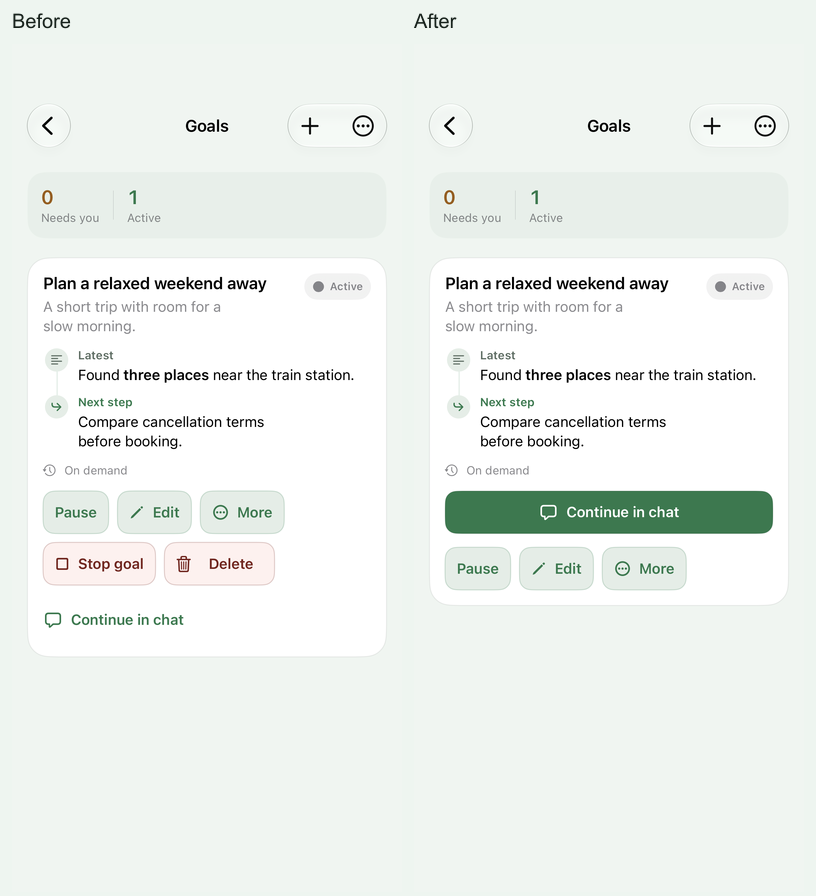

# Assistant visual and usability review — 3 October 2026

This is a screenshot-led refinement of the existing Assistant identity. The everyday product is the iPhone assistant; the running browser is its owner console. Retained browser product routes are reviewed as actual source components with synthetic data and remain redirected by the production proxy.

## Direction and shared foundations

The interface should feel like a calm assistant's working notes: readable conversation, clear decisions, useful records, and quiet administration. Keep the existing green paper and native type; make the structure easier to understand before adding decoration.

| Foundation | Implemented browser treatment |
| --- | --- |
| Canvas and material | Green paper `#EEF5F0`, white raised material, `#E3EDE6` tonal wells; corresponding green charcoal dark tokens. |
| Reading and secondary ink | `#15201A` / `#5A6D62` in light; `#EEF5EF` / `#9CB0A2` in dark. Reply-paper secondary ink now matches the shared light value. |
| Action | `#217A4B` in light, `#6FCB9C` with dark foreground in dark. Neutral controls use semantic ink. |
| Conversation control material | Opaque green wells `#1E613E` / `#193424`, shared with native, with `#F4FAF5` strong and `#C6DDCF` supporting ink. Bare-stage web text uses brighter ink. |
| Type | Platform system family. Sentence-case interface labels and section titles; monospaced text is reserved for actual codes and evidence. |
| Hierarchy | A clear page title, a short explanation, 18 px section titles, reading content, supporting metadata. Counts remain secondary. |
| Geometry | Shared page gutters and bounded reading width; 16 px utility surfaces; consistent padding; 44 px form fields. |
| Motion | Controls respond to interaction. Records stay readable at first paint and do not animate into view during scrolling. |

Page actions sit beside the title on larger screens and receive their own row on phones. Long titles, statuses and identifiers wrap. Detail facts collapse into a readable vertical sequence on narrow screens. Field labels identify the input, and empty/error states explain the next useful step.

The console header uses the existing app mark and a restrained navigation row. This visual emphasis belongs to app identity; section labels, form groups and records do not each need their own decorative treatment. Access records use divided rows, while a new credential or an important result receives an appropriate surface and hierarchy.

## Screenshot evidence

The [before/after gallery](assets/ui-review-2026-10-03/index.html) contains 615 comparison entries: 482 baseline and 614 final full-size screenshots, with filters for page, surface, appearance and width. Contact sheets show only the first viewport; full-page originals must be opened to inspect lower content.

- **Browser console:** every reachable page, both shared-key Settings variants, the root failure page, route-error/not-found recovery and a long-content component fixture. The final matrix contains 96 layouts across 320, 390, 640 and 1280 px in light/dark. The [console review](console-ui-review-2026-10-03.md) records page-specific changes and interaction evidence.
- **Retained browser product pages:** every retained route is accounted for by 26 actual page components and one legacy redirect assertion. The [per-page audit](web-experience-2026-10-02.md#retained-product-page-visual-review-3-october-2026) records the 51 loaded/empty/view presentations and the availability distinction.
- **Native app:** 75 real destinations have before/after coverage, including pages, detail views, editors, guides and menus. Eight additional empty/error variants bring the final inventory to 83 presentations. The gallery preserves 196 baseline and 272 final native PNGs, including enlarged text and lower scroll positions. The [native page review](../../apps/ios/docs/ui-review-2026-10-03.md) records every destination, implementation change and simulator result. The earlier [native audit](ios-experience-2026-10-02.md) retains its compilation-only evidence as dated history.

All captured content is synthetic. Screenshot fixtures neither access the owner's account nor send email, book travel, create live credentials, upload documents, or run paid inference.

## Concrete improvements

The shared browser changes reach every page built on the common header, section, card, field, badge and fact-grid primitives. The page-specific passes also address problems discovered in pixels and interaction:

- Settings separates the server address, existing devices, creation form and access/recovery destination.
- Security distinguishes passkeys, recovery, devices and browser sessions, with consistent rows, explanations and focused failure recovery.
- Audit leads with useful task identity, progress and labelled time/cost; exact identifiers and payloads remain available as evidence. Detail uses one consistent evidence selector across widths.
- Sign in and Setup have bounded reading width, an understandable next step and layouts that shrink correctly with enlarged text.
- Knowledge filters retain readable selected values instead of a clipped desktop selector.
- Improvements, writing voice, skills and privacy controls use the shared form, card and dark-state treatments.
- Failed skill saves and issue reports preserve their drafts. Report opening and cancellation hand focus to the appropriate control; saved/error outcomes are announced beside the action.
- Calls and Activity use consistent navigation and section typography.
- Conversation styling is imported with its page, and the column receives the space below the actual header. Side-chat controls remain readable on their stage. Empty-chat suggestions clear the composer on phones. Eight real hydrated ChatClient layouts establish the settled height, separately from the static matrix's pre-effect composer estimate.
- Confirmed credential changes keep their one-time key or recovery code when the next list refresh fails. The owner sees that the change succeeded and can retry the reads without repeating the mutation. Failed mutations retain their distinct failure state.
- Recall provenance keeps full-opacity reading ink on both conversation and notification paper. A failed Stop request uses a readable error surface, retains its retry control and does not show a false stopped receipt. Four additional hydrated examples verify those branches in both appearances.

Native refinement uses the same semantic materials while retaining platform navigation, scrolling and forms. Shared forms and grouped settings now have persistent field labels, clearer section hierarchy, 44 pt minimum rows and consistent section spacing. The Goals card gives continuation one dominant action; stopping and archiving live in More with explicit confirmations. Activity replaces its boxed “Loaded activity” summary and distribution graphic with useful status counts. Improvements gives reporting and review a clearer hierarchy instead of repeating large introduction surfaces. Memory keeps its caption outside the fixed-height map preview so it can grow with text size, and More uses menu pickers when accessibility text makes segmented controls too cramped.

This derived preview illustrates the action hierarchy. The gallery retains the original full-size captures.

The full native run also exposed misleading cancellation recovery. A cancelled suggestion answer or card refresh no longer claims that the connection changed. Genuine connection replacement still rejects the old response; cancellation publishes no optimistic receipt.

The final contrast pass caught ordinary navigation ink blending with a translucent header over the stage, and stage text weakened by opacity. The former pair measured 2.75:1; the original light stage-muted pair measured 3.01:1. The updated conversation controls share an opaque, darker well across clients. Its strong pair measures 7.00:1 in light and 12.73:1 in dark; supporting ink measures 5.17:1 and 9.40:1. These are semantic token calculations, with browser checks of resolved text/surface combinations and separate inspection of native renders. [WCAG's normal-text threshold is 4.5:1](https://www.w3.org/WAI/WCAG22/Understanding/contrast-minimum.html); passing these pairs does not certify every app surface or accessibility interaction.

## Validation boundaries

Browser screenshots render the actual React components and compiled stylesheet against isolated fixtures. The console also hydrates its real client controls against synthetic owner APIs and WebAuthn responses. Retained Skills, writing voice and repair reporting receive actual hydrated failure/retry checks. Chat receives eight settled phone layouts using its actual AI SDK client and polling hook with intercepted reads; the remaining retained components have static rendering coverage.

These captures establish layout and specified presentation/interaction behavior. They do not establish production response time, live account integration, voice/audio behavior, hardware biometrics, or every possible generated response. Route availability, screenshot fixtures, executed tests and real-device checks must remain distinguishable.

## Final verification

| Verification | Executed result |
| --- | --- |
| Console visual and interaction harness | 96 responsive/theme layouts; 10 credential scenario groups; empty/error/retry, keyboard/focus, appearance and enlarged-text checks passed. |
| Retained product matrix | 204 static layouts plus six hydrated form error/recovery captures; all 27 retained routes accounted for, including one legacy redirect. Four separate hydrated recall/failure examples cover stage and notification paper in both appearances. |
| Settled conversation | Eight hydrated phone layouts: primary/side, empty/loaded, light/dark. Measured composer reserve matches its 70 px height; document and viewport are 844 px. Intercepted status reads only; no send, voice, owner read or provider request. |
| Native visual evidence | 196 baseline PNGs / 75 destinations; 272 final PNGs / 83 presentations. The final set includes 58 enlarged-text viewports and 92 lower scroll viewports, overlapping subsets of the total. |
| Native XCTest | 380 total: **379 passed, one skipped, zero failures** on iOS 27.0 arm64, iPhone 17 Pro Simulator. All three screenshot/contrast tests passed; the complete suite executed in 253.558 seconds after the explicit initializer correction. The optional previously generated Markdown readability corpus is absent, so that separate test skipped. |
| Focused browser source tests | Six files / 80 tests passed. Covers console rendering/evidence scope, retained-page inventory, portable message/provenance rendering and improvement action availability. |
| Production web build | Passed with development authentication bypass disabled. |
| Repository typecheck | All 14 package tasks and the scripts check passed. |
| Lint and boundaries | Completed with no errors; 25 repository warnings and four informational notices remain. Architecture boundary check passed. |
| Gallery integrity | Every linked image exists. All 69 native/hydrated source hashes and 272 final native image hashes match. Chrome checks passed at 320 and 1280 px, including filters and opening the original 1206 × 2622 native image; no script errors. [Machine-readable checks](assets/ui-review-2026-10-03/gallery-checks.json). |
| Whitespace | `git diff --check` passed. |

The UI-only native run exposed four failing cases: a chat-follow test that omitted the authenticated draft scope, an older code-fix receipt expectation, a graph test assuming a fixed zoom before background preparation completed, and misleading cancellation recovery. Test setup/expectations were corrected to assert current behavior; cancellation was fixed in production source and receives explicit cancellation/owner-replacement regressions. The final full suite passed. One intervening runner attempt hung before XCTest started; the isolated simulator was restarted and the successful run recorded its own result bundle. Neither compilation nor a launch timeout is counted as executed test evidence.

The release integration then preserved the newer main-branch per-property Observation model and bounded reads. Two additional native regressions verify draft observation and discarding an overview captured before an owner replacement. Parallel transport fixtures are keyed by endpoint, and cancellation does not assume both child requests started. The final combined-source suite passed; its 272 native captures are the current gallery After set. The earlier UI-only set is retained in the local `after-native-before-merge` directory and commit `db720dae`. See the [release integration record](release-2026-10-03.md).

The first hosted iOS build used Xcode 26.6 and rejected a synthesized private `ChatView` initializer that the newer local compiler accepted. An explicit initializer preserves the four-inset API and private fixture state. The corrected source passed the full local suite and received a fresh capture export; hosted compatibility still requires a successful iOS workflow. The preceding combined-source export remains preserved in `after-native-release` as historical integration evidence.

Before screenshots remain unchanged. The static browser chat matrix records pre-effect layout; its initial composer estimate can leave a 42 px full-page screenshot overhang. The separate hydrated entries establish the actual settled layout and remove that overhang. The final native capture loop follows real List content as recycled rows appear, reaches the bottom, and includes presented sheets. The baseline traversal used estimated heights and missed some lower sections; those additional final viewports are after-only evidence. Native images preserve the original Display P3 captures and exported attachment hashes; contrast sampling converts those pixels to sRGB rather than treating the source profile as ordinary RGB.

Earlier behavior and architecture reports retain their original verification boundaries. This review adds simulator rendering and execution evidence; it does not retroactively turn an earlier compile-only run into a device test. Physical caret/selection, directory pulls, keyboard transitions, speech, VoiceOver, biometrics, real connector effects and production performance remain separate acceptance work.
