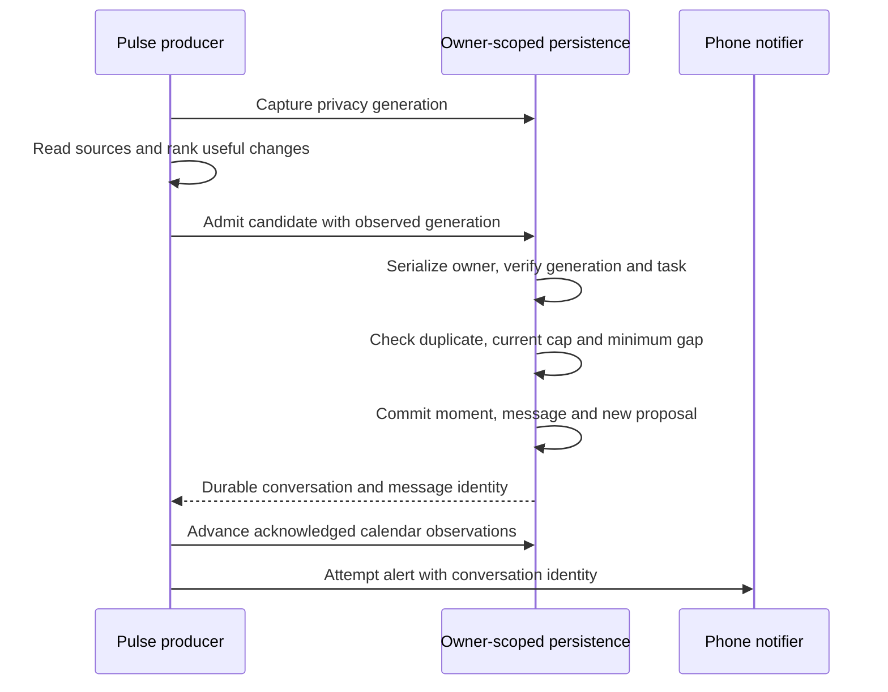

# Durable proactive pulse admission

Implemented October 3, 2026, in the current checkout. This contract covers the
`pulse.check` producer on PostgreSQL and Firestore. It is not a production
cutover, a shared queue for every proactive producer, or a guarantee that a
phone received a notification.

## Why the transaction changed

The old flow saved a unique moment claim, created an optional suggestion, and
then posted the owner message. A crash or encoding failure between those writes
could leave a claim that permanently suppressed information the owner never saw.
Separate workers considering different candidates could also both pass the same
hourly or daily reads before either saved its claim.

The replacement makes admission a domain command with one commit. The command
checks owner identity, privacy generation, source identity, current preferences,
and pacing, then persists the ledger entry, owner message, and any new inert
suggestion together. An exception rolls the transaction back; a retry can make
the information visible. No provider or phone request runs inside this boundary.

## Results and selection

`PulseRepository.admitNotice` returns `persisted`, `already-said`, `min-gap`, or
`daily-cap`. A persisted result identifies the moment, message, conversation,
and whether a new suggestion was created. A rejected result creates none of
those records. Exceptions represent failed or invalid admission rather than a
successful quiet decision.

The producer ranks candidates deterministically. It skips an already announced
candidate and considers the next one; it stops when a current pacing limit
blocks new information. Cheap preliminary reads avoid unnecessary source work,
but the transaction rechecks the authoritative admission limits. The hourly gap
and rolling 24-hour cap refer to retained pulse messages. The owner's stricter
ambient cap wins over the pulse maximum of six. A legacy Firestore cap of zero
continues to suppress ambient notices; PostgreSQL settings constrain that owner
preference to at least one.

Calendar changes retain their previous baseline until their notice is durable
or the key is already known. A crash after message commit but before snapshot
advancement therefore encounters the old change, recognizes its existing key,
and advances without creating a second message. Unselected changes remain
available for a later eligible run.

## Adapter boundaries

PostgreSQL locks the existing owner row. All pulse candidates for that owner
and the privacy-erasure transaction serialize through that lock. Admission
checks the optional task's owner, prefers an active primary chat, and otherwise
uses the existing shared advisory lock to find or create the Notifications
conversation. It rejects ambiguous or mismatched fallback records. Existing
unique owner/source constraints protect moment and proposal identities.

Firestore uses an installation-scoped owner coordination document, stable
moment/message identities, and a transaction that performs all destination and
proposal reads before any writes. Reading and updating the coordination record
makes different candidate keys contend, rather than only identical keys.
Bounded queries respect the configured cap. The owner-notice adapter exposes
transactional preparation and append helpers so message serialization and
conversation routing remain consistent with ordinary owner notices.

Imported ledger-only moments remain announced for deduplication. The app cannot
prove whether an old message existed or was removed, so it does not fabricate
or resend one. Existing accepted, dismissed, snoozed, or imported suggestions
are preserved; admission includes an actionable suggestion part only when it
creates a new proposal. The new proposal references the committed conversation.
Creating a proposal grants no permission to perform its external action.

## Privacy across an observation

The producer captures an opaque erasure generation **before** reading source
content. Admission checks that same generation while holding its transaction.
An active erasure blocks publication, and a completed erasure invalidates content
read before deletion. Merely checking that erasure is no longer active would
allow an older worker to republish information after deletion completed.

PostgreSQL retains a random generation in existing maintenance metadata while
removing the completed erasure's result marker. Firestore retains its existing
erasure-job generation. These generations contain no erased personal content.
No new schema or database migration is required. This fences pulse message and
proposal publication; it does not claim that every other producer or calendar
snapshot writer now participates in a universal erasure contract.

## Message durability and phone delivery

The message is the durable in-app result. Phone alerting follows commit and
uses the conversation identity; failure cannot undo or erase that result.
Current notifier interfaces return no delivery disposition. A successful
invocation can include intentional quiet suppression, and an accepted APNs
request does not prove presentation on a device. The existing `pinged` field
therefore records successful notifier invocation, not confirmed phone receipt.

A durable phone-delivery outbox, explicit suppressed/deferred/failed states,
cross-producer attention budgets, and device acknowledgements remain follow-up
work. The task wake outbox is an execution mechanism and is not repurposed as
a phone-delivery ledger.

## Validation and sources

The focused PostgreSQL/core/privacy run passed 48 tests across four files.
The isolated local Firestore run passed 43 tests across seven suites, including
14 new admission cases and adjacent owner-notice, privacy, nudge, outbox and
portable-job behavior. These runs exercise same-key retries, different-key
contention, the last cap slot, preference changes, rollback after staged writes,
imported claims, answered proposals, completed/active erasure, and owner/task
boundaries. The integrated review records the complete-suite result separately.

Sources: [shared contract](../packages/persistence/src/pulse.ts),
[selection and integration](../packages/core/src/proactive/pulse.ts),
[PostgreSQL admission](../packages/db/src/pulse-admission-repository.ts),
[PostgreSQL erasure](../packages/db/src/privacy-erasure-repository.ts),
[Firestore admission](../packages/firestore/src/pulse.ts),
[Firestore notice seam](../packages/firestore/src/owner-notices.ts),
[PostgreSQL cases](../packages/db/src/pulse-admission-repository.test.ts),
[Firestore cases](../packages/firestore/src/pulse.test.ts).
