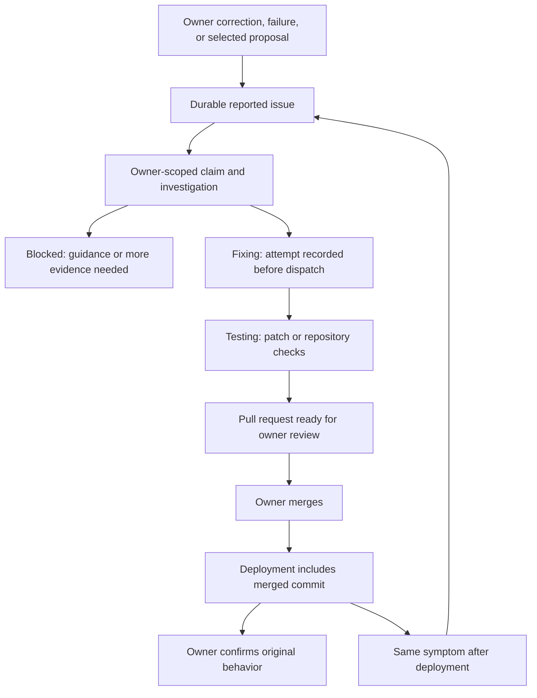

# Self-improvement: evidence, decisions, and verified outcomes

Source review: October 3, 2026. This describes the implementation in this checkout. Local verification does not establish that these changes are deployed or that a hosted coding worker has completed a real repair.

The assistant has two connected improvement paths. A reliability review proposes changes to model routing or records advice. A repair investigation turns actionable feedback or failures into a tested pull request. Recording a suggestion, requesting an investigation, changing routing, passing tests, deploying code, and confirming the original behavior are separate outcomes.

## From a signal to a proposal

[`runSelfImprove`](../packages/core/src/workflow/improve.ts) reviews one owner's recent signals through the selected persistence adapter. The normal review window is seven days; graph extraction health also includes outstanding failed sources and stale leases. PostgreSQL scopes tool calls and model calls through their owning task. The Firestore adapter confirms ownership through task or memory records rather than trusting an absent owner field on telemetry.

| Signal | Current trigger | What it establishes |
| --- | --- | --- |
| Tool failure pattern | At least two failures of the same tool and normalized error; the eight largest groups | A recurring symptom worth investigating. It does not establish a code defect. |
| Stuck work | Failed or needs-attention tasks with at least two attempts | Recovery may be unreliable or require owner input. |
| Expensive calls | Calls costing at least $0.10; the five largest are included | A cost outlier. No conclusion that a cheaper model can perform the same work. |
| Response contract corrections | At least two blocked responses, with unsupported-claim counts | The deterministic final-response contract corrected recurring problems. |
| Required-action retries | At least two required action steps without a tool call | The model sometimes failed to act on an action request. |
| Fallback use | At least two degraded steps | Routing or provider reliability needs review; fallback alone is not a quality failure. |
| Unavailable output verification | At least two unavailable final-response checks | The review mechanism needs attention. |
| Graph extraction health | At least two failed sources, or any pending lease older than ten minutes | Memory ingestion is impaired or stalled. |

With no actionable signal, the job returns without embedding or drafting. Otherwise it saves a short assistant-authored experience memory, with a 90-day expiry, and asks the `batch` model for at most three proposals. Experience memory is a reliability observation, not a verified personal fact. The Firestore write uses the task lease and a review checkpoint so a reclaimed task cannot save it twice.

Correction telemetry includes a rejected optional response-review candidate and an unsupported numeric live-lookup draft. The original checked answer survives a rejected optional revision; successful source cards survive a failed or ungrounded live reply. The response-check correction signal describes what enforcement rejected, while the delivered answer determines whether the responsibility remains unfinished. `outputVerificationRevised` records that a replacement candidate was supplied, not that it passed the contract or was delivered.

Proposals contain a kind, title, rationale, proposed change, and up to twenty cited identifiers or aggregate signal descriptions. Both stores deduplicate by owner, kind, and title, including settled and imported proposals. Only newly inserted proposals trigger a review notice. The notice now says that the review changed no model settings or code; it does not imply that background experience memory was untouched.

Sources: [signal port](../packages/persistence/src/self-improvement.ts), [Firestore review](../packages/firestore/src/self-improvement.ts), and [Firestore job coverage](../apps/agent/src/firestore-self-improvement.test.ts).

## Review is an explicit owner decision

The Improvements page and mobile workspace show the newest hundred open proposals. A proposal remains open after refused validation, with an actionable error. There is no automatic routing change through this job, including when conversational autonomy is enabled.

| Owner action | Durable effect | Receipt |
| --- | --- | --- |
| Apply a valid model proposal | Update the requested routing fields and close the proposal in one transaction | `applied`, `enacted: true`; routing changed, with no claim that quality improved |
| Apply a proposal matching current routing | Close the already satisfied proposal | `already_current`, `enacted: false` |
| Mark a policy, prompt, or note reviewed | Close the advisory proposal | `acknowledged`, `enacted: false`; no settings or code changed |
| Dismiss an open proposal | Close the proposal as dismissed | `dismissed`, `enacted: false` |
| Repeat a settled decision | Preserve the first recorded decision | `already_decided`, `enacted: false` |
| Request a code fix from an advisory | Create or reuse an owner-scoped repair report, then acknowledge the proposal | Report ID, actual repair status, and a receipt distinguishing queued work from an existing report |

The historical database status `applied` also represents advisory acknowledgments. It is not proof that configuration or code was changed. The API and web actions now return the explicit outcome above; native and web presentation consume that distinction. Settled proposals cannot be reopened or relabeled by another late apply/dismiss request.

Routing validation requires a configured role, nonblank cited evidence, and at least one named model. Every requested model must exist, be enabled, have finite nonnegative prompt and completion prices, and match embedding versus conversational role use. Explicit zero prices are valid; empty prices are not. A malformed, disabled, missing, incompatible, or unpriced fallback refuses the whole proposal rather than silently applying the primary alone. Blank optional model fields from the drafting schema mean that field was not requested. Defined nonstring fields are rejected.

PostgreSQL locks the owning agent and proposal, checks the active erasure marker, locks the selected models and role, and commits routing plus decision together. Firestore reads owner identity, erasure state, proposal, models, and role before buffering both writes in one transaction. Competing apply/apply or apply/dismiss decisions converge on one winner. Failure to persist the proposal decision rolls back the routing change.

Sources: [shared validation and receipts](../packages/persistence/src/workspace-improvements.ts), [PostgreSQL decision](../packages/core/src/workflow/improve.ts), [Firestore decision](../packages/firestore/src/workspace-improvements.ts), [owner application operations](../packages/application/src/operations.ts), [shared web service](../apps/web/lib/workspace-reviews.ts), and [mobile action route](../apps/web/app/api/mobile/v1/improvements/[id]/route.ts).

## From a report to a confirmed fix

Reports come from explicit authenticated owner requests, qualifying corrections in chat, recent failed tasks, or code-shaped self-maintenance findings. Chat attaches the original related assistant task when available, so investigation can inspect the failed task's audit instead of its own reporting activity. Task and conversation evidence must belong to the owner. Direct corrections such as “That's wrong,” “That didn't save,” “You made that up,” and “I don't see the change” are recognized. Quoted examples, pasted blockquotes, fenced code, general discussion, and explicit requests not to file or investigate do not authorize automatic feedback capture. This is a conservative English matcher, not a general multilingual intent classifier.

Repair reporting hashes stable source identity. Proposal conversion uses the proposal ID, so simultaneous or later clicks reuse the same report. A repeated request can return a failed, blocked, reviewing, monitoring, or resolved report; it never authorizes a new coding attempt. The response includes the real status and says to review existing progress instead of falsely saying work was queued. Report persistence happens before advisory acknowledgment: if acknowledgment fails, repeating the request recovers the existing report without duplicating work.

The repair repository claims one eligible report per owner atomically. Another investigation, coding attempt, testing attempt, or open PR blocks the next claim. A retry normally joins the back of the queue; a recorded owner request for **Run now** has priority and permits one attempt beyond the automatic allowance. The scheduler and repository claim use the same readiness policy. Firestore also advances an existing enabled repair schedule when a report or retry is saved, so the minute sweep can deliver the wake.

Investigation reads a bounded owner-scoped audit and includes deployment capabilities in its technical context. The `reason` model must supply a diagnosis, synthetic reproduction, and acceptance criterion. Established configuration/provider issues stop with guidance. Actionable bugs, missing features, unknown causes, and incorrect answers may reach the worker; classification alone does not prove the repository is correct. Protected paths are blocked before dispatch.

The `fixing` state and attempt timestamp are saved before external dispatch. An explicit preflight/API rejection becomes failed. A timeout after possible acceptance remains fixing and is reconciled by session, attempt, branch, or workflow identity instead of blindly dispatching again. Investigations expire after thirty minutes. An attempt without an observable session, run, or PR fails after two hours and requires owner recovery.

Sources: [repair orchestration](../packages/core/src/workflow/self-repair.ts), [repair port and queue policy](../packages/persistence/src/self-repair.ts), [application decisions](../packages/application/src/self-repair.ts), [proposal conversion](../apps/web/lib/proposal-code-fix.ts), [chat feedback capture](../packages/application/src/chat-turn.ts), [self-maintenance](../packages/core/src/workflow/self-maintenance.ts), and [schedule recovery](../apps/agent/src/repair-schedule.ts).

## Validation, promotion, and spending boundaries

The hosted worker receives an immutable source checkout and a synthetic technical brief. Credentials and original owner conversations/audits are not placed in the generated-code sandbox. Publication requires reproduced behavior or a missing requested feature, a changed regression/acceptance test, 1–20 permitted files, bounded decoded content and an independently checked GitHub diff. The backend does not execute a returned patch in the application environment.

A hosted candidate becomes a draft PR. Its exact published commit must pass the required GitHub Actions checks: static checks, verification, Firestore, build smoke, and applicable native checks. Skipped native checks are accepted only when the patch contains no iOS files. The assistant then marks the draft ready and notifies the owner. A completed model turn, a generated test filename, or a successful session is not sufficient evidence.

The legacy GitHub worker verifies a patch in separate jobs before publication. It identifies work by issue branch and workflow run. Older PRs on a reused issue branch are now excluded from a newer attempt's reconciliation. Because the legacy publisher itself reuses an existing PR, a known prior GitHub PR cannot be retried as though it were a fresh attempt: review that PR, or create a new report. Hosted retries use attempt-specific branches, wait for session cleanup, and preserve earlier drafts.

Merge and deployment remain separate from validation. A merge records a commit. Monitoring starts only when the configured health endpoint reports a deployed SHA whose GitHub ancestry includes that commit. Only the owner can confirm resolution from monitoring. A matching failure observed after deployment marks the old fix failed and creates a linked report.

Automatic dispatch defaults to two attempts per rolling twenty-four hours, configurable from one to five. Investigation runs through the scheduled task's model budget; it has a sixty-second provider deadline and at most one distinct configured fallback. Hosted coding has its own twenty-minute deadline; draft checks have a one-hour deadline. An authenticated **Run now** request bypasses only the automatic attempt allowance, once. Protected paths, active-work exclusion, provider/model budgets, and owner review still apply. External hosted tokens and sandbox time are not a guaranteed dollar cap in the assistant's dispatch ledger; use a dedicated provider/project spending boundary.

Neither path merges, deploys, force-overwrites an existing repair branch, or automatically reverts production. Routing transactions roll back on persistence failure. Reversing a completed routing decision currently requires an explicit Settings change; reversing code requires the normal reviewed repository revert. There is no retained baseline snapshot or automatic rollback controller.

Sources: [hosted worker](../packages/core/src/workflow/repair-hosted.ts), [GitHub worker](../packages/core/src/workflow/repair-github.ts), [legacy publisher](../scripts/repair-publish.mjs), [worker workflow](../.github/workflows/self-repair.yml), and [operator setup and recovery](self-repair.md).

## Scenario verification in this continuation

Eight focused pure/mocked suites passed **128 tests** after these changes. They exercise malformed evidence/model fields, disabled/unpriced/incompatible models, direct and quoted feedback, owner opt-out, hosted cleanup/retry boundaries, stale deployment evidence, old versus current PR timestamps, actual API receipts, existing-report conversion, and authenticated web actions. They do not make paid model calls or mutate live code.

The coordinated canonical run passed **4,600 tests across 615 files, with zero skips**, in 1,032.37 seconds. It includes six real PostgreSQL improvement-decision tests, ten Firestore emulator improvement tests, and fifteen shared validation tests. These cover duplicate decisions, apply/dismiss races, foreign owners, complete-swap validation, missing roles, already-current routing, and injected proposal-write failure after routing was staged. The source remained unchanged during the run. The pure-suite result above is separate from this transaction and emulator evidence.

The full run used a 30-second test and hook deadline, with unchanged behavior assertions, after three scenario fixtures exceeded the default five-second deadline. Fixture setup and module loading are not app-latency measurements. Scripted execution, database races, and worker mocks do not establish live-model improvement, a deployed repair, or physical-device behavior. See the [behavior review](behavior-review-2026-10-03.md) for the final validation record.

Test sources: [shared validation](../packages/persistence/src/workspace-improvements.test.ts), [PostgreSQL decisions](../packages/core/src/workflow/improve-decisions.test.ts), [Firestore decisions](../packages/firestore/src/workspace-improvements.test.ts), [repair decisions](../packages/application/src/self-repair.test.ts), [repair loop](../packages/core/src/workflow/self-repair.test.ts), [GitHub evidence](../packages/core/src/workflow/repair-github.test.ts), [proposal conversion](../apps/web/lib/proposal-code-fix.test.ts), [mobile receipts](../apps/web/app/api/mobile/v1/improvements/[id]/route.test.ts), and [web review actions](../apps/web/app/improvements/actions.test.ts).

## Remaining architectural gaps

| Gap | Current limitation | Next acceptance criterion |
| --- | --- | --- |
| Measured routing promotion | Nonblank citations and routability are checked; cited IDs are not resolved into a measured before/after result. The drafting model does not receive a current candidate catalog. | Give the reviewer actual enabled candidate IDs and a frozen evaluation manifest; promotion requires supported behavior, quality, latency, and cost results on the same corpus. |
| Reversible routing history | Open-only projection and legacy status do not provide a complete decision history or prior configuration snapshot. | Store explicit outcome, actor, baseline routing, candidate routing, validation run, and reversible owner decision. |
| Duplicate learning by symptom | Proposals deduplicate forever by exact title, not a durable symptom/measurement identity. Rewording can generate repeats; the same settled title can suppress a later recurrence. | Use a stable symptom key plus evidence window, and link recurrences to prior decisions. |
| Honest scientific claims | Aggregate failures and outliers suggest investigations. Passing repository checks does not show the assistant became more useful across real conversations. | Evaluate held-out behavior scenarios, compare uncertainty and errors, and monitor measured regressions after owner-approved promotion. |
| Provider spending | Dispatch counts and timeouts are not complete external billing reconciliation. | Record attempted provider work, unknown billing, usage, sandbox charges, and an enforceable attempt-level spending ceiling. |
| Durable coding allowance | The rolling count derives from the last thirty status-history entries and `fixing` transitions rather than an immutable dispatch ledger. Very long retry histories or nonmonotonic worker states need stronger accounting. | Give every dispatch its own durable attempt identity and cost/allowance entry. |
| One state machine across workers | Legacy GitHub issue branches and hosted attempt branches have different recovery contracts. | Share a durable attempt record while preserving provider-specific transport evidence. |
| Conversion versus cancellation | Report creation precedes proposal acknowledgment; a conflicting late dismissal does not cancel already recorded repair work. | Expose the linked report and explicit cancellation policy; do not describe dismissal as undoing an accepted investigation. |
| Notification recovery | Repair notices depend on idempotent delivery plus a recorded notified status. A nightly proposal notice is best-effort after insertion. | Persist a durable owner-notice delivery intent with the proposal batch so a failed notice can be retried without drafting duplicate proposals. |
| Human and multilingual feedback | Matching is conservative English text. Audit/report evidence can be incomplete, and synthetic brief privacy partly depends on the investigation model. | Add multilingual, adversarial quote/negation cases and deterministic brief validation without copying personal audit data to the worker. |

The target architecture is a measured improvement loop: observe a recurring symptom, preserve minimal evidence, propose a bounded experiment, validate against an independent frozen baseline, obtain the appropriate owner decision, promote reversibly, and monitor the original behavior. The implementation currently provides substantial execution and publication boundaries; it does not yet implement every measurement, history, and rollback step in that target loop.
