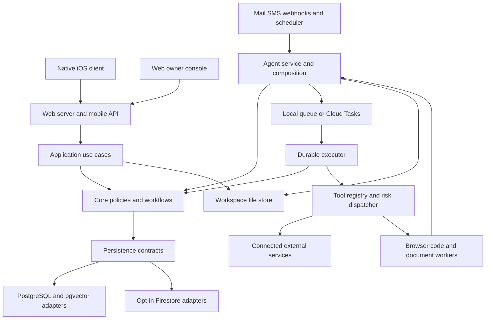

# Assistant system architecture and decision reference

Assistant is a server-hosted agent system with a native iOS client and a web owner console, durable workflow execution, owner-controlled memory, and optional service integrations. Its architecture separates presentation, application use cases, business policy, persistence contracts, provider tools, and process composition. The model proposes language and actions; authenticated application commands, tool policy, durable records, and provider evidence determine what actually happens.

This reference explains runtime flows, data responsibilities, technology choices, and the architectural decisions recoverable from the current code and design notes. Reviewed **October 2–3, 2026**. It describes source, defaults, and intended boundaries, not an independently verified production deployment. See [the product guide](product-guide.md), [capability reference](capability-reference.md), and [gap register](product-gaps.md) for the experience and availability limits.

## Runtime structure

This diagram shows responsibility and data flow, not a claim that every legacy function already depends only on an abstract port. Some core, application, and integration paths still use concrete PostgreSQL adapters. The Firestore migration and architecture boundary checks make that remaining scope explicit.

### Processes

| Process | Responsibility | Durable authority |
| --- | --- | --- |
| Web service | Owner authentication, pages, server actions, streaming chat, versioned mobile API | Application commands and selected persistence adapters |
| Agent service | Integration ingress, module installation, task execution, scheduler/sweep work, callbacks, realtime call bridge | Task and tool state, leases, approval records, event deduplication |
| Browser worker | Bounded browser plan execution and artifacts | Job result reconciled by the agent |
| Code worker | Bounded code execution and workspace artifacts | Job result reconciled by the agent |
| Document worker | Heavy extraction and OCR | Document processing state and accepted callback |
| Migration/backup jobs | Schema reconciliation, exports, imports, backup and restore | Explicit migration and recovery ledgers |
| Repair environment | Isolated investigation, reproduction, tests, and proposed patches | Repair issue state and independently checked GitHub PR |
| iOS application | Native interaction, speech, location opt-in, polling, notifications, Live Activities | Server response and state; local device preferences are exceptions |

The current browser proxy exposes only owner administration and read-only audit pages; retained chat/workspace pages are dormant. Mobile APIs remain the everyday client boundary. The phone does not run the durable agent loop. Closing a browser or phone screen does not cancel server work. A server task, its conversation, and its currently visible client row are different objects.

## Package responsibilities and dependency direction

| Package or directory | Owns | Boundary |
| --- | --- | --- |
| `packages/config` | Typed environment schema, defaults, module names, readiness validation | No workspace dependencies |
| `packages/persistence` | SDK-independent record shapes and repository/command contracts | No database SDK; contracts and shared validation/helpers |
| `packages/db` | PostgreSQL schema, Drizzle migrations, seed, repositories | Storage adapter; does not depend on core/tools/apps |
| `packages/firestore` | Firestore repositories, index contract, encoding, migration/import and validation helpers | Storage adapter using persistence contracts |
| `packages/core` | Task lifecycle, workflow policy, approvals, memory, routing, schedules, costs, situations | Does not import provider tool or presentation packages; concrete SQL compatibility remains |
| `packages/application` | UI-facing commands/queries and serializable views | Clients request use cases rather than assemble business rules; some SQL compatibility remains |
| `packages/tools` | Tool declarations, registry, risk dispatch, provider and workspace adapters | Depends on core contracts and persistence; does not own deployment composition |
| `packages/modules` | Optional capability metadata, installation, route/hook/channel declarations | Sibling modules communicate through platform ports |
| `packages/setup` | Installation planning and resumable setup state | Uses shared configuration/module metadata |
| `apps/agent` | Runtime composition, HTTP ingress, poller/sweep, integration callback mounting | Creates adapters and installs selected modules |
| `apps/web` | Next.js pages, UI, routes/actions, web composition | UI consumes application views; server composition owns infrastructure |
| `apps/ios` | SwiftUI client and Apple system integration | Consumes authenticated `/api/mobile/v1`; no direct database access |
| `workers/*` | Credential-minimized isolated jobs | No main app, database, or model-provider credential dependency |
| `infra/*`, `scripts/*` | Provisioning, release, tests, migration, diagnostic operations | Explicit operational entry points |

`pnpm check:boundaries` enforces dependency and presentation rules and is included in lint/CI. The existing [architecture document](architecture.md) describes these rules and module extension steps. Treat the checker and current migration baseline as the concrete enforcement contract; do not infer that the whole codebase is already a purely database-independent domain model.

Sources: [package architecture](architecture.md), [boundary checker](../scripts/check-boundaries.ts), [web composition](../apps/web/lib/server.ts), [agent dependencies](../apps/agent/src/deps.ts).

## Configuration and capability composition

`assistant.config.ts` declares the module definitions built into the installation. `ASSISTANT_MODULES` narrows that composition at runtime; it cannot install a definition absent from the build. The current composition includes browser, calendar, calls, code, documents, Google Workspace, maps, push, reminders, search, SMS, and watches.

Module metadata declares settings, readiness, infrastructure, billing, routes, and job ownership. Runtime definitions register tools and provide hooks for webhooks, sweep steps, poller ticks, deterministic task handlers, delivery channels, owner notification, and inbound-mail observation. Installation validates that declared routes and handlers agree. Metadata consumers can inspect modules without importing their provider runtime.

A module can be built in, selected, and still not ready. Missing credentials keep unavailable tools out of selection. Disabled integrations lose their tool and channel capability. Some selected-but-unready routes remain mounted with guards so setup can recover. Internal scheduler endpoints can deliberately return a benign skipped result instead of failing a recurring scheduler invocation.

The typed configuration distinguishes independent axes:

| Setting | Choice | Effect |
| --- | --- | --- |
| `PERSISTENCE_DRIVER` | `postgres` or opt-in `firestore` | Durable record adapters, subject to port coverage |
| `LLM_PROVIDER` | Default `openrouter` or explicit `vertex` | Environment fallback provider; saved model connections can coexist |
| `QUEUE_DRIVER` | `local` or `cloudtasks` | How runnable tasks receive delivery/wake attempts |
| `FILES_DRIVER` | `local` or `gcs` | Workspace bytes and artifacts |
| `OWNER_AUTH_MODE` | `google` or `passkey` | Owner login and device-access flow |
| `INTERNAL_AUTH_MODE` | `oidc` or local shared secret | Internal ingress authentication |
| `CHAT_RECALL_ENABLED` | Boolean, default false | Automatic historical context injection |
| `GRAPH_RAG_ENABLED` | Boolean, default false | Graph-assisted recall, additionally gated by chat recall |

Secrets and non-secret settings share the same schema names locally and in cloud deployment. Local `.env` values are not repository documentation or safe source material to copy. Google Secret Manager supplies cloud secrets. Configuration loads and validates at process boundaries; optional-provider diagnostics and production fatal requirements have different purposes.

Sources: [composition](../assistant.config.ts), [typed configuration](../packages/config/src/index.ts), [module contract](../packages/modules/src/contract.ts), [runtime hooks](../packages/modules/src/platform.ts), [module installation](../packages/modules/src/install.ts), [environment reference](../.env.example).

## Conversation request lifecycle

1. The server authenticates the owner/device and scopes the conversation.
2. The application persists the owner's message and reads the relevant recent history. Hidden entries and selected operational noise are excluded from model history.
3. Request classification and deterministic guards determine whether a tool-free conversational stream is appropriate or durable execution is required. Personal-service reads, saves, and action requests must reach the corresponding execution path rather than a model pretending to perform them.
4. Eligible private context is assembled: compact owner profile, recent history, selected situation decisions, current ambient context, and bounded recall where enabled.
5. A conversational answer streams, or a durable task is created and dispatched. A task can reply later or park for permission, money, time, or an external event.
6. The final reply passes evidence and presentation checks. Structured message parts retain cards, recall sources, suggestions, decisions, and notices.
7. Clients reconcile streamed/optimistic rows with the durable record and refresh changing inline state. An answer-ready notification can reach an inactive owner when the delivery path is configured.

A client timeout does not establish that the task failed. A successful streaming response does not establish that a tool ran. The task and tool ledger are authoritative for claims about external work.

Sources: [turn routing](../packages/application/src/chat-turn.ts), [triage](../packages/application/src/chat-triage.ts), [chat projection/polling](../packages/application/src/chat.ts), [executor](../packages/core/src/workflow/executor.ts), [response contract](../packages/core/src/workflow/response-contract.ts).

## API and client state

The versioned mobile API is a presentation transport over shared commands and queries. Bootstrap,
overview, workspace, and narrower endpoints supply serializable state suited to the client screen.
The client does not issue database joins or call model providers with server credentials. Web server
actions and native API mutations reach the same business meaning even where compatibility adapters
still differ by backend.

| Transport family | Principal paths | Responsibility |
| --- | --- | --- |
| Conversational turns | `/api/chat`, `/api/chat/status`; mobile `/api/mobile/v1/chat` and `/chat/status` | Streaming and durable-task handoff/status |
| Native initial/read state | Mobile `/bootstrap`, `/overview`, `/workspace`, `/activity/foreground` | Pairing/bootstrap, screen projections and current work |
| Conversation management | Mobile `/chats`, `/chats/[id]`, `/chats/[id]/messages/[messageId]` | Lists, archive/model/read state, message curation |
| Work and decisions | Mobile `/activity`, `/activity/[id]`, `/goals`, `/goals/[id]`, `/approvals/[id]`, `/suggestions/[id]` | Work views and authenticated decisions |
| Memory and people | Mobile `/memory/*`, `/knowledge/*`, `/people/*` | Fact/profile/library/graph/commitment/occasion queries and edits |
| Cards and planning | Mobile `/cards`, `/cards/[id]`, `/packs`; web `/api/live/scoreboard` | Grounded saved objects, refreshes, planning and supported live projections |
| Files and ingestion | `/api/documents/upload`, `/api/import/upload`, `/api/files`; mobile `/documents/*`, `/imports` | Upload boundaries, processing state, private artifact reads |
| Connections and settings | Mobile `/providers/*`, `/mcp/*`, `/settings/*`, `/devices`, `/location` | Provider/tool connections, preferences, device registration and context |
| Calls and improvement | Mobile `/calls/*`, `/skills/*`, `/costs`, `/anomalies/*`, `/improvements/*`, `/repairs/*` | Operational/native work areas |
| Owner access | `/api/owner/*`, `/api/auth/[...nextauth]` | Mode-specific claim/login/recovery/passkeys/devices/sessions |
| Privacy and diagnosis | `/api/profile-export`, `/api/audit/[id]` | Authorized export and diagnostic evidence |
| Liveness/readiness | `/api/health`, `/api/ready`; agent health/readiness routes | Release identity and configured service health |

Unless written in full, mobile suffixes in this table are relative to `/api/mobile/v1`. Wildcards
summarize a route family; they are not endpoints accepting arbitrary suffixes. Exact methods and
input shapes live in the route handlers and application contracts.

Long-running turns combine streaming with subsequent polling/long-polling. The native client
optimistically displays a sent message and streamed reply, then replaces temporary identity with
durable server identity. Changing approval, suggestion, budget, and card state is refreshed even
when the underlying message text did not change. In-flight decisions are reconciled so a stale read
does not resurrect an approval just answered on the phone. Foreground/background and active-work
polling policy adapt the work needed rather than assuming one constant poll interval proves
delivery.

Native pairing verifies a candidate authenticated bootstrap before replacing the current connection.
The same configuration and owner preserve the draft session; a changed configuration or owner resets
local projections, navigation intent, optimistic overlays and private drafts. Shared projection reads
and conversation-affecting commands capture a connection generation and check it before publishing
after an await. Newer conversation/navigation intent wins over a delayed read. The private
conversation-scoped draft value avoids publishing global state on each keystroke. The current client
has one foreground reply coordinator, so chat switching, creation and model changes wait for completion
or stop. See [session architecture and interface cleanup](ui-simplification-2026-10-03.md) for the
implemented boundaries, tests and remaining return-valued query work.

Offline or suspended clients cannot guarantee immediate visible state. Remote push can alert a
closed app, while the next authenticated read supplies current authority. Error/empty/loading
states must distinguish unavailable data from an actual empty list. A device permission denial, an
unreachable server, invalid access, provider quota, and blocked task each require a different next
step.

Sources: [web route tree](../apps/web/app/api), [chat long polling](../packages/application/src/chat-long-poll.ts),
[native API client](../apps/ios/Assistant/Networking/APIClient.swift), [native state model](../apps/ios/Assistant/AppModel.swift).

## Durable execution

### Plan and checkpoint

A task stores its normalized trigger, trust, conversation/goal association, plan, checkpointed state, progress, next action, deadline, budget, attempt count, and scheduling information. Executor state includes working context and completed/pending call identity. Full tool results remain in their own records instead of indefinitely growing the prompt.

The executor can run a model/tool loop or dispatch a known maintenance code job. “Code job” here means a deterministic registered handler; some handlers still call a model for bounded extraction or synthesis. It is different from the `code.execute` sandbox tool.

### Claim and fencing

Runnable work is claimed under a lease. The opaque lease token fences older workers even when timestamps collide. The worker renews and checkpoints through guarded repository commands. Queue generations identify runnable transitions and help deduplicate wake delivery. Firestore uses transactional counterparts and a durable outbox on exercised paths.

External calls do not run inside retryable database transaction callbacks. Transactions can retry; sending an email from one would duplicate side effects. Durable records and idempotency keys instead coordinate claim, approval, provider execution, and outcome recording.

### State meanings

| Stored status | Meaning | Usual next transition |
| --- | --- | --- |
| `pending` | Runnable work waiting to be claimed | Running |
| `running` | A leased executor is working | Continue/checkpoint, park, or settle |
| `waiting_approval` | A concrete decision is pending | Approved/denied/expired resolution |
| `waiting_event` | An external result or response is required | Callback or manual resolution |
| `sleeping` | Not runnable before a future time | Scheduled wake |
| `waiting_budget` | Money allowance, not time or permission, is blocking work | Budget decision or permitted retry |
| `needs_attention` | Automatic progress cannot continue usefully | Owner intervention/eligible retry |
| `done` | The workflow settled successfully | History/archival |
| `failed` | A recorded failure settled the task | Eligible retry or investigation |
| `cancelled` | Work was explicitly stopped | History/archival |

Bounded retries and exponential backoff prevent an ordinary failure from churning forever. Reclaimed leases without progress are counted so a killed or stuck worker cannot be reclaimed indefinitely. Sweep work recovers overdue tasks, lost queue wakes, stale job state, and missing attention notices. These defenses provide practical at-least-once resilience, not a universal exactly-once guarantee for every external API.

### Long-running goals

A goal holds the outcome and automation settings. A schedule launches bounded mission work. Mission context and updates preserve continuity across sessions. A work chat is the natural detailed log; selected mirrored updates go to Notifications. A deadline shapes work without keeping a model invocation open until that deadline.

Sources: [task schema](../packages/db/src/schema.ts), [state transitions](../packages/core/src/workflow/machine.ts), [dispatch](../packages/core/src/workflow/dispatch.ts), [queue](../packages/core/src/queue.ts), [missions](../packages/core/src/workflow/missions.ts), [schedules](../packages/core/src/workflow/schedules.ts), [Firestore sweep](../apps/agent/src/firestore-sweep.ts).

## Tool execution and permission

Tools declare a name, description, validated input schema, risk, trust handling, execution adapter, and structural flags. Risk can be autonomous, approval-required, or forbidden, and some tools compute it from arguments. Calendar writes to the owner's calendar and calendar invitations are an example of different consequences behind one tool family.

The dispatcher checks tool availability and input, task/context trust, policy denies and eligible allows, recipient evidence, taint-sensitive effects, autonomy floors, rates, idempotency, and budget reservation. Preparation can normalize the final outbound content before an approval is created so the decision concerns the payload that will actually run.

An approval freezes a concrete queued call or other explicit decision. Execution revalidates identity and payload and claims it before effect. Standing permissions are structured rules with eligibility limits; they are not a prompt saying “please be safe.” Approval grants permission, while budget reservation independently grants spend capacity.

### Task autonomy

An authenticated owner action can arm a task grant through the composer, a reviewed card, or a goal setting. The grant records source, grant time, expiry, and revocation. The default lifetime is 24 hours. External text cannot arm it, and tainted-origin tasks cannot acquire it through ordinary arming paths.

Even with an active grant, explicitly floored tools, memory writes from untrusted context, and unverified recipients retain approval. Policy denies and budgets remain enforced. Phone calls and Situation Pack writes have explicit exact-approval protections. There is no current universal all-actions YOLO bypass.

### Third-party content and trust

Tasks distinguish owner, known, unknown, and assistant origins. Reading external material can taint a workflow even when the original task came from the owner. External text is reference material, not instructions. Private context is withheld from ineligible workflows; external-sender registries omit private tools. Accepting a suggestion originating in mail preserves its tainted origin rather than laundering it into unrestricted authority.

Recipient verification prevents a model from freely sending to an invented email or phone number. An owner-authored address or known contact is evidence; it does not bypass every other permission rule. MCP results and telephone speech participate in the same untrusted-data model.

Sources: [tool contracts](../packages/tools/src/types.ts), [risk dispatcher](../packages/tools/src/dispatcher.ts), [policy matching](../packages/tools/src/policies.ts), [autonomy](../packages/core/src/workflow/autonomy.ts), [suggestion lifecycle](../packages/core/src/workflow/suggestions.ts), [MCP scopes](../packages/tools/src/mcp.ts).

## Memory and retrieval architecture

### Data layers

| Layer | Stores | Used for |
| --- | --- | --- |
| Messages | Original turns and structured parts | Transcript, recent context, explicit history search |
| Conversation segments | Summary, message range, dates, embedding | Retrieval of meaningful historical discussions |
| Durable memories | Facts/preferences/episodes/experience, source/trust, confidence, importance, validity and expiry | Deeper personal recall and learning |
| Compiled owner card | Selected owner facts and important people | Small private context supplied before deeper search |
| Contacts and occasions | Identity, relationships, important dates | People management and timely context |
| Graph entities/relations/sources/aliases | Canonical entities, direct evidence-backed relationships, reconciliation state | Explainable relationship retrieval and review |
| Documents/chunks | File metadata and extracted searchable passages | Grounded document question answering |
| Commitments | Open decisions, questions, promises, waiting-on items | Follow-through and proactive context |
| Situation decisions | Explicit choices/reasons and confirmed lasting preferences | Situation planning and bounded decision recall |
| Writing samples/profile | Suitable owner writing and distilled style | Drafting in the owner's writing voice |
| Skills | Advisory procedures, preconditions, gotchas and outcome counts | Reusing successful working methods |
| Ambient context | Fresh position/time/weather snapshot | Current owner context, without durable location history |

### Historical conversation recall

Offline segmentation uses time gaps, embedding drift against a running centroid, and bounded group size. Summaries and their embeddings are derived indexes over the original owner/assistant thread. The original conversation is not routed into hidden topical threads. Current defaults are documented in the product guide and implemented in segmentation, not an owner-configured single “X messages” trigger.

On eligible turns, automatic recall embeds the query and prefers qualifying segment summaries. If none qualifies, it retrieves historical message neighborhoods. It excludes the live recent window, deduplicates overlapping results, enforces similarity and prompt limits, and persists lightweight source provenance for the UI. Empty retrieval is an honest result; it is not proof that the owner never discussed the subject.

### Durable learning and correction

Extraction proposes useful information from permitted sources. Saved memories carry origin trust and can be quarantined. Consolidation resolves duplication and contradictions, assigns domains, and rebuilds the profile. Owner confirmation has precedence in conflict handling. Experience memories can expire; current personal knowledge and superseded historical facts have different use conditions.

Corrections can immediately supersede contradicted facts and invalidate the compiled card. Supported portable commands embed before their transaction and compare source content so a concurrent edit does not silently overwrite newer information. A failed profile rebuild must not retain a fact retired by the same supported correction path.

Forgetting removes usable content and derived graph data and retains tombstones. Those suppress re-extraction from the same source; they do not promise that unrelated newly supplied evidence can never mention the same subject. Hidden messages, archived records, stale facts, and forgotten facts are distinct states.

### Knowledge graph and GraphRAG

The graph is stored alongside the memory system, using relational tables in PostgreSQL or portable adapters where implemented. It does not require a separate graph database. Every direct relation belongs to a source memory and carries a contiguous supporting quote. Sources checkpoint content hashes and extraction versions. Entity aliases keep future extraction aligned with owner merges. Dates use canonical identities anchored to source timestamps.

Sync runs offline in bounded batches. Failed sources back off and can be quarantined; owner review distinguishes usable edges from connections retained only for audit. Confirming, rejecting, merging, and manually adding source-backed relations are explicit curation operations. Graph cleanup and deterministic date repair are distinct from paid re-extraction.

Graph recall first requires a semantic source match, then traverses a bounded neighborhood of up to two hops. It injects source facts and labels indirect connections as context. It does not save inferred transitive relationships as facts. Graph and historical recall share the query embedding and budget; one failing retrieval layer should preserve useful evidence from the other.

### Prompt context ownership

The compact owner card is selected deterministically rather than rebuilt by a model for every turn. Pinned facts and a limited number of high-importance facts enter it; the remainder stays available through retrieval. Owner context, historical recall, graph recall, and fresh location are gated by private/trust eligibility. A telephone model only receives its approved brief, and an external-sender task does not receive the owner's private profile merely because it can trigger a workflow.

Sources: [memory design](long-running-chat-memory.md), [recall](../packages/core/src/memory/recall.ts), [graph recall](../packages/core/src/memory/graph-recall.ts), [graph sync](../packages/core/src/memory/knowledge-graph.ts), [extraction](../packages/core/src/memory/extraction.ts), [consolidation](../packages/core/src/memory/consolidation.ts), [supersession](memory-supersession.md), [temporal validity](temporal-validity.md).

## Proactive architecture

### Detect then decide whether to interrupt

Integration observers and scheduled jobs read structured sources rather than asking a model to monitor everything continuously. Gmail synchronization and an ingest ledger record incoming mail. Calendar snapshots and changes support salience and conflicts. Watches record owner-defined matches and content transitions. Commitments and saved planning sources supply follow-through context.

Proactive producers decide whether there is meaningful news. Delivery and nudge policy then decide whether the owner should be interrupted. Notices and phone alerts are separate legs: quiet hours or an ambient cap can suppress an alert while retaining the in-app record. Interrupt-level decisions have different treatment. Existing ledger/cap contracts vary by producer; they do not yet establish one shared attention lifecycle.

`pulse.check` now admits its moment, owner message and any new suggestion in one owner-serialized transaction on both PostgreSQL and Firestore. It rechecks the current owner cap and rolling pace window, skips announced source keys, and compares a privacy generation captured before reading content. A completed erasure invalidates an older observation. Calendar changes advance after the durable notice outcome. Phone notification follows commit and remains best effort; the current notifier result does not establish actual device delivery. See [durable pulse admission](durable-pulse-admission.md) for rollback, imported-record and adapter semantics.

Suggestions have accept, dismiss, and snooze states and stable source identities to avoid repeatedly proposing an answered item. Acceptance creates ordinary work. It does not imply that every later external action is approved.

### Current scheduled work

These are checked-in PostgreSQL seed definitions, not a claim about every installation's enabled schedule. Times use the applicable schedule timezone; owners can pause work, and seed-owned definitions have reconciliation rules. Firestore seeding/composition has its own delivery status.

| Seeded job | Default cadence | Purpose |
| --- | --- | --- |
| Chat segmentation | Daily 21:00 | Historical discussion summaries and embeddings |
| Memory extraction | Daily 22:00 | Candidate durable facts and commitments |
| Open-loop sweep | Every six hours at minute 35 | Retire untouched/overdue commitments without a model |
| Email extraction | Every four hours at minute 20 | Bounded memory extraction from mail ingest |
| Daily briefing | Daily 07:45 | Structured news/conflicts/actionable changes; quiet if no news |
| Pulse | Every 20 minutes | Timely, paced notice or suggestion evaluation |
| Tomorrow check | Daily 19:30 | Look ahead to meaningful next-day issues |
| Memory consolidation | Daily 22:30 | Deduplicate, resolve and compile the profile |
| Knowledge graph sync | Twice hourly at minutes 15 and 45 | Backfill/reconcile source-backed relationships |
| Graph curiosity | Daily 12:15 | A bounded question about a meaningful knowledge gap |
| Graph date backfill | Daily 03:05 | Deterministic date normalization without model calls |
| Approval anomaly scan | Daily 23:00 | Policy-activity outliers |
| Skill reflection | Daily 23:30 | Advisory procedural learning |
| Self improvement | Daily 00:00 | Evidence-based improvement proposals |
| Ambient refresh | Every 30 minutes | Fresh owner context and weather |
| Dream/reflection | Daily 00:30 | Bounded hypotheses and anticipations, distinct from confirmed facts |
| Self maintenance | Daily 01:00 | Bounded improvement backlog/diagnosis |
| Self repair | Every 15 minutes | Configured repair investigation and reconciliation |
| Health monitor | Daily 01:15 | Persistent indexing/recall/response-quality issues |
| Document processing backstop | Every 15 minutes | Recover eligible missed/stale processing jobs |

Watches support bounded fire counts and expiry. Current public-web watches use deterministic `change`, `contains`, and `absent` matching in a sweep step. They do not implement the entire generic frozen-action watcher design. Specific application-confirmation workflows implement a narrower approved-bundle discipline.

Sources: [seed schedules](../packages/db/src/seed.ts), [briefing](../packages/core/src/workflow/briefing.ts), [Pulse](../packages/core/src/proactive/pulse.ts), [nudge policy](../packages/core/src/proactive/nudge-policy.ts), [watch implementation](../packages/modules/src/watches/web-watches.ts), [anticipation design and shipped limits](anticipation-layer.md).

## Grounded responses and cards

The response contract compares final claims with tool/task evidence. Unsupported claims of sending, saving, researching, or modifying a service are blocked or replaced with understandable status. Current-read answers and write confirmations have specialized grounding rules. A bounded model self-review supplements this; deterministic checks retain authority if the reviewer fails or supplies an unsuitable result.

The card compiler produces a constrained, serializable spec from permitted evidence. It checks displayed values and supplies revisions, actions, expiry/freshness, and sensitive-field information. Clients render that spec rather than running arbitrary generated application code. Source-grounded cards can stand in for an answer; answer-grounded cards can lead explanatory prose.

Saved card revisions support refresh and planning-source comparison. Server state and a grounded source remain necessary: presenting a ticket does not confirm it was purchased by Assistant. Legacy parsing is compatibility logic, not permission to guess missing facts from a sentence.

Sources: [response contract](../packages/core/src/workflow/response-contract.ts), [output verification](../packages/core/src/workflow/output-verification.ts), [card compiler](../packages/core/src/generative-card.ts), [generative UI](generative-ui.md), [saved cards](../packages/application/src/cards.ts).

## Model routing and spending

The router selects models by role and supports conversation overrides. Text provider connections include OpenRouter, OpenAI, Vertex, and explicitly configured compatible gateways. Connections and keys are server-side, with encrypted persisted credentials and bounded refresh of connection state. Realtime phone providers are a separate audio path. iPhone speech synthesis/transcription is local.

Model roles split conversational, agent/tool, planning, classification, extraction, rewriting, and embedding responsibilities. Owner-facing main/fast choices map onto these roles; role defaults and provider fallbacks retain more detailed internal configuration. Specific model names and prices belong in the dated [model routing reference](model-routing.md) and current catalog, rather than the product promise.

Before an operation, conservative cost is reserved against task and aggregate limits. Afterwards, observed usage or provider-reported cost is recorded and the hold settled. Unknown cost is not automatically treated as zero. Provider failure, rate/quota refusal, budget exhaustion, and unsupported models have distinct consequences.

The operation ledger and provider billing overlap. Google Cloud Billing via BigQuery and OpenRouter account reporting supply provider views; the ledger supplies attribution and enforced operation budgets. Cloud invoices, billing-export delays, currency, credits, and hosted-repair sandbox spend cannot be reduced to one model-token counter.

Embedding model/provider/dimension define a retrieval space. Changing the ordinary chat model is reversible routing configuration; changing the embedding space requires provenance-aware re-embedding and migration.

Sources: [provider adapters](../packages/core/src/model-router/provider.ts), [router](../packages/core/src/model-router/router.ts), [connection management](../packages/core/src/model-router/connections.ts), [cost policy](../packages/core/src/cost.ts), [billing reference](cost-tracking.md), [Google provider](google-model-provider.md).

## Stored data responsibilities

The SQL schema has separate record families so that presentation, retrieval, execution, permissions, and billing do not collapse into a single chat-log table. Exact field definitions and checks are in [the schema](../packages/db/src/schema.ts); SDK-independent record types and migration coverage are in [persistence contracts](../packages/persistence/src/index.ts).

| Family | Principal records |
| --- | --- |
| Identity and conversation | Agents, conversations, channel bindings, messages, segments |
| Work | Goals, tasks, schedules, tool calls, application confirmations |
| Decisions and governance | Approvals, policies, suggestions, anomalies, health alerts |
| Calls and integrations | Call sessions, MCP connections, Gmail sync state, email ingest, watches/fires |
| Memory | Memories, tombstones, owner card, contacts, graph entities/aliases/sources/relations, occasions, commitments |
| Planning and learning | Situation packs/previews, skills, writing samples/profile, dream notes |
| Documents and assets | Files, documents, chunks, import sources; bytes in workspace storage |
| Models and finance | Model connections/catalog/roles/calls/audit, cost events/reservations/rates/budgets |
| Context and notifications | Location pings, ambient snapshots, notification preferences, proactive pings/moments, calendar snapshots, device tokens |
| Operations | Maintenance cursors, tool cache, rate limits, canary runs, response checks, recall metrics/feedback, self-maintenance and repair issues |

Owner access records for passkeys, sessions, recovery, and devices are managed through the auth services and selected adapters. They are not tool approvals. Migration inventory covers the declared source tables and derived Firestore records; a field shape being represented does not establish that every writer/read path is portable.

## Privacy, credentials, and boundaries

### Access

Web routes/actions require owner authentication. Mobile routes authenticate a server/device credential and enforce owner scope. Passkey mode supplies one-time owner claim, passkeys, recovery codes, sessions, and separately revocable devices. Existing Google-auth mode and shared mobile token pairing remain supported. Native credentials use Keychain; UI preferences such as appearance/speech use device-local storage.

Internal cloud callbacks use route-scoped Google OIDC and identity/audience validation. Local shared-secret mode has a different deployment contract. Twilio ingress uses signature validation; location webhook ingest uses HMAC with timestamp replay protection. Per-launch job/voice tokens are narrow callback capabilities. Public fetch, browser, and MCP boundaries validate network destinations rather than trust model-supplied URLs.

### Secrets and data minimization

Provider/MCP bearer secrets are encrypted at rest using the configured encryption key and decrypted at the adapter boundary. They are not returned in client settings responses. Isolated jobs receive purpose-limited input/storage access rather than the main database and model credentials. Repair coding receives an immutable checkout and synthetic brief; publication credentials belong to a trusted publishing boundary, not the generated code environment.

The app is self-hostable but model calls can send eligible prompt context to the configured provider. Phone calls send approved speech/brief information to telecom/realtime providers. On-device dictation/read-aloud avoids a server audio dependency. “Owner-owned server” does not mean every integration or model operation is offline.

### Lifecycle controls

Long-term-memory export deliberately excludes secrets and embeddings and differs from an operational backup. Erasure uses durable fencing/cleanup so concurrent processing does not immediately restore deleted projections. Tombstones prevent relearning from the same source. Imported source artifacts and planning decision memory have specific erasure effects; explicit plans and original conversations are separate scopes.

History, cost, model-audit, operational metrics, and location have distinct retention settings or policies. A forever-style conversation UX does not override configured history retention. Current position freshness (30 minutes) is much shorter than default ping retention (three days). Location is not automatically extracted into semantic memory.

Sources: [owner auth](../apps/web/lib/owner-auth/service.ts), [mobile connection contract](../apps/ios/README.md), [internal routes](../apps/agent/src/routes/internal.ts), [secret encryption](../packages/core/src/mcp-secrets.ts), [location](../packages/core/src/memory/location.ts), [privacy commands](../packages/application/src/profile/privacy.ts), [privacy erasure](../packages/application/src/profile/privacy-erasure.ts).

## Deployment and persistence migration

### Local and existing cloud deployment

Local development uses Node/pnpm processes or Docker Compose with PostgreSQL/pgvector, migration, agent, web, and workspace storage. The cloud deployment provisions Cloud Run services/jobs, Cloud Tasks, Cloud Scheduler, integration Pub/Sub where enabled, Cloud Storage, Secret Manager, and least-privilege service accounts. Browser/code/document jobs are conditional on modules.

Releases reconcile schema/seed/configuration and build verified images. Backup, restore, and provenance checks have dedicated operational paths. Faster single-service releases have narrower eligibility; they are not the general migration/release path. Native app distribution is a separate build and TestFlight/App Store process.

### Firestore direction and current limits

PostgreSQL is the default persistence driver. Firestore has substantial transactional/read/recall/application adapters, migration tools, an index manifest, deny-all client rules, emulator contracts, and real-cloud rehearsal evidence. This is an in-progress migration, not a new default declared by this guide.

The latest dedicated status document reports production remaining on PostgreSQL at its dated checkpoint. This documentation task did not query live production. Complete activation requires current coverage of startup, enabled modules, management and context writers, asset parity, backup/restore, an offline-PostgreSQL rehearsal, fencing, and customer onboarding. A successful health endpoint or a portable reminder implementation does not satisfy those gates.

### Customer-owned installation

The consumer-install direction is customer-owned Google Cloud infrastructure, data, credentials, billing, release archive verification, and owner access, without a required vendor-hosted control plane. Provisioning and resumable state exist, but the one-click fresh-account flow is not documented as complete. The install status, preparation, image publication, runtime seeding, model probe, and owner-claim references separate these milestones.

Sources: [self hosting](self-hosting.md), [operations](operations.md), [recovery](recovery.md), [Firestore status](firestore-implementation-status.md), [cutover gates](firestore-cutover-checklist.md), [consumer install plan](firestore-consumer-install-plan.md), [iOS shipping](../apps/ios/docs/shipping.md).

## Technology inventory

Versions below are **declared dependency ranges/pins in the reviewed source**, not claims about the newest public releases or every deployed binary. The lockfile supplies resolved JavaScript dependencies; Dockerfiles can add separately pinned runtime dependencies. A complete direct-dependency inventory appears in the [capability reference](capability-reference.md).

| Technology | Role and reason visible in the implementation | Declaration or source |
| --- | --- | --- |
| Node.js | Server/worker JavaScript runtime; cloud images target Node 22 | Root engine `>=22`; Docker `node:22-slim` |
| TypeScript | Shared typed domain, application and provider code | Root `^7.0.2`; web `^5.9.3` |
| pnpm workspaces | Shared packages and deterministic dependency installation | Root `pnpm@10.34.5` |
| Turborepo | Workspace build/typecheck/dev orchestration | Root `^2.11.4` |
| Next.js | Web pages, server actions, HTTP/mobile routes | Web `^16.3.6`, explicit webpack scripts |
| React and React DOM | Web rendering and client interaction | Web `^19.3.0` |
| Tailwind CSS/PostCSS | Web style system | Web `^4.3.2` |
| Hono and Node server adapter | Agent HTTP ingress | Agent `^4.13.9`, adapter `^2.1.1` |
| Vercel AI SDK | Text streaming/generation and provider abstraction | `ai ^7.0.116`, React integration `^4.0.119` |
| OpenRouter/OpenAI/Vertex/compatible AI SDK adapters | Configured text and embedding providers | Core manifest and provider adapter |
| Google GenAI SDK and WebSockets | Gemini/OpenAI live call bridge | Core `2.24.0`; `ws 8.22.0` |
| PostgreSQL and pgvector | Relational operational state plus semantic vector indexes | Compose `pgvector/pgvector:pg17` |
| Drizzle ORM and Drizzle Kit | SQL schema/query/migration layer | ORM `^0.45.3`, kit `^0.31.11` |
| postgres.js | PostgreSQL transport | DB `^3.4.9` |
| Google Cloud Firestore SDK | Opt-in persistent document/transaction/vector adapter | Firestore `^9.2.0` |
| Google auth library | ADC and authenticated cloud operations | `^10.9.1` in applicable manifests |
| Zod | Input, configuration, tool, and contract validation | `^4.6.5` |
| Croner | Cron/timezone schedule calculation | Core `^10.0.1` |
| dotenv | Local configuration loading | Config `^18.0.4` |
| Auth.js/NextAuth | Existing Google owner-auth flow | Web `5.0.0-beta.32` |
| SimpleWebAuthn | Browser/server passkey ceremony | Web browser `^14.0.0`, server `^14.0.3` |
| jose | Signed/token-based protocol handling | Agent `^6.2.11` |
| OpenTelemetry and OTLP | Server tracing and diagnostic correlation | Agent/core manifests and `otel.ts` |
| react-markdown, remark-gfm, remark-math, rehype-katex, KaTeX | Markdown, tables, and math presentation | Web manifest |
| Mermaid | Constrained diagram presentation in replies | Web `^12.0.0` and native diagram view |
| DOMPurify | Sanitize supported generated/rendered markup | Web `^3.4.16` |
| Lucide React | Web icons | Web `^1.48.0` |
| Playwright and Chromium | Browser jobs and browser verification | `^1.63.0`; browser Dockerfile |
| unpdf | Direct text-bearing PDF extraction | Core manifest; agent Dockerfile has its own runtime pin |
| Mammoth, ExcelJS, JSZip | Office/spreadsheet/archive extraction | Document worker manifest |
| Tesseract OCR and Poppler | Scan OCR and PDF rasterization | Document worker Dockerfile |
| Python, NumPy, pandas, Matplotlib and openpyxl | Bounded data analysis, charts and spreadsheet outputs in the code worker | Docker pins: NumPy 2.1.3, pandas 2.2.3, Matplotlib 3.9.2, openpyxl 3.1.5 |
| Swift, SwiftUI, UIKit | Native layout, interaction, text controls, rendering | iOS source; no third-party iOS dependencies |
| AVFoundation and Speech | On-device speech synthesis and transcription | SpeechPlayer/SpeechListener; iOS 26 |
| Core Location | Opt-in position and significant-change updates | Native location manager |
| UserNotifications/APNs, ActivityKit/WidgetKit | Phone alerts, badge, Live Activity/Dynamic Island | Native system/widget code and push module |
| Keychain and device preferences | Mobile secrets and local appearance/speech intent | Native connection/settings code |
| MapKit/Apple Maps Server API | Grounded directions and route-map presentation | Maps core/tool and route components |
| Docker and Compose | Reproducible local/cloud process isolation | `infra/docker`, Compose file |
| Terraform and Google Cloud CLI | Customer foundation and existing deployment orchestration | Consumer Terraform and GCP scripts |
| Cloud Run, Tasks, Scheduler, Pub/Sub, Storage, Secret Manager, IAM | Hosted execution, delivery, bytes, secrets, and identity | GCP infrastructure and module plans |
| BigQuery Billing export | Actual exported cloud billing, separately from operation estimates | Provider-billing application use case |
| Gmail/Calendar/Drive/Docs/Sheets/Slides APIs | Connected Workspace tools | Google module and tool adapters |
| Twilio | SMS, dialing, signed ingress, call media | SMS/calls modules and adapters |
| APNs HTTP provider | Remote owner alerts | Push tool/module |
| Streamable HTTP MCP | Owner-added remote tool servers | MCP adapter and settings flow |
| Open-Meteo and ESPN data adapters | Grounded weather and supported sports lookups | Ambient/weather and sports core |
| GitHub Actions and GitHub API | CI, releases, repair publication/reconciliation | Workflows and repair adapters |
| OpenAI-hosted repair environment | Optional isolated coding/investigation backend | Hosted repair adapter; requires separate setup |
| Vitest, xcodebuild, Firestore emulator | Unit/integration, native and portable persistence checks | Test scripts, workflows, iOS tests |
| Biome, tsx, esbuild, sharp | Formatting/lint, TS execution, agent bundling, brand/image build utilities | Root/agent manifests |

## Architecture decision register

This register records major current decisions. **Documented** means the choice/rationale is stated in source comments or a design note. **Inferred** means the rationale below is an engineering interpretation of the current structure, not a recovered historical ADR or owner approval. Historical deliberations not recorded in the repository cannot be exhaustively reconstructed.

| Decision | Rationale and consequence | Evidence status and reference |
| --- | --- | --- |
| One primary chat with visible side chats | Preserve a stable relationship while keeping detailed goal work discoverable | Documented: [long-running chat](long-running-chat-memory.md) |
| Bounded live history plus retrieval | Control latency/cost and avoid low-signal context growth | Documented: [chat turn](../packages/application/src/chat-turn.ts), [recall](../packages/core/src/memory/recall.ts) |
| Soft offline segmentation instead of hidden topic routing | Bad boundaries affect retrieval without misfiling live discussion | Documented: [segmentation design](long-running-chat-memory.md) |
| Separate episodic, fact, graph, document, and profile layers | Each representation has a different evidence and lifecycle contract | Documented structure; combined rationale inferred: memory source files |
| GraphRAG complements vector recall | Relationships add explainable context while preserving original evidence/fallback | Documented: [graph recall](../packages/core/src/memory/graph-recall.ts) |
| Only direct source-backed graph edges | Prevent traversal from promoting hypotheses into stored facts | Documented: [graph extraction](../packages/core/src/memory/knowledge-graph.ts) |
| Deterministic compact profile | Keep stable owner context cheap and inspectable, with deeper facts retrieved on demand | Documented: [compilation](../packages/core/src/memory/consolidation.ts) |
| Owner confirmation, temporal validity and tombstones | Correct personal knowledge and avoid immediate relearning after erasure | Documented: [supersession](memory-supersession.md), [validity](temporal-validity.md) |
| Model prose is subordinate to execution evidence | Prevent convincing but false completion/read claims | Documented: [response contract](../packages/core/src/workflow/response-contract.ts) |
| A delivered failure explanation does not complete an unverified effect | Preserve unfinished responsibility in Activity; retain separately verified partial effects and cards | Documented: [behavior review](behavior-review-2026-10-03.md), [finalization](../packages/core/src/workflow/executor/finalize.ts) |
| No-tool answer boundaries also govern recovery | Fictional approval prose or provider-ignored tool choice cannot turn an explanation/read answer into unrelated work | Documented: [executor loop](../packages/core/src/workflow/executor/step-loop.ts), [scenario corpus](../packages/tools/src/question-regression/scenario-corpus.ts) |
| Deterministic enforcement around bounded model review | Best-effort reflection must not weaken the evidence contract | Documented: [output verification](../packages/core/src/workflow/output-verification.ts) |
| Durable tasks with checkpoint/lease/fence | Recover work after crashes and reject stale executors | Documented: [machine](../packages/core/src/workflow/machine.ts), persistence adapters |
| Approval, budget and execution are separate gates | Permission to act is not permission to overspend or proof of effect | Documented: [dispatcher](../packages/tools/src/dispatcher.ts) |
| Structural taint and private-context gating | External content can inform work without authoring instructions or receiving private history | Documented: dispatcher, [suggestions](../packages/core/src/workflow/suggestions.ts) |
| Bounded owner-armed autonomy with a hard floor | Reduce routine friction without granting every tool unrestricted authority | Documented: [autonomy](../packages/core/src/workflow/autonomy.ts) |
| Suggestions separate from frozen approvals | An idea has no queued effect; an approval concerns concrete work | Documented: [anticipation](anticipation-layer.md) |
| Shared nudge policy across producers | Independent proactive jobs must not collectively over-interrupt | Documented: [nudge policy](../packages/core/src/proactive/nudge-policy.ts) |
| Quiet primary conversation, separate background log | Preserve readable conversation while retaining operational evidence | Documented: [chat voice](chat-voice.md), executor notices |
| Goals launch bounded sessions | Pursue long outcomes without an unbounded model call | Documented: [missions](../packages/core/src/workflow/missions.ts) |
| Advisory skills instead of executable permissions | Learn methods without bypassing policy | Documented: [Skills page](../apps/web/app/skills/page.tsx) |
| Revisioned declarative cards compiled on the server | Ground facts consistently across clients and constrain generated UI | Documented: [generative UI](generative-ui.md) |
| Packs are planning state, separate from real effects | Rehearsal/corrections must not silently change bookings or messages | Documented: [Situation Packs](situation-packs.md) |
| Isolated credential-minimized workers | Limit consequences of generated browser/code/document work | Documented: [architecture](architecture.md), worker contracts |
| Metadata-driven optional modules | Derive readiness, tools, routes, infrastructure and billing from one capability declaration | Documented: [modules](modules.md) |
| Shared use cases with web and native transports | Avoid separate client business rules and support consistent decision state | Documented: [architecture](architecture.md), mobile transport |
| Native text interaction and separate speech projection | Preserve familiar editing and make structured replies usable by ear | Documented: [on-device speech](on-device-speech.md), native composer |
| Phone brief isolation and mandatory disclosure/approval | Bound what a realtime model may share/agree to during third-party interaction | Documented: [phone calls](phone-calls.md) |
| Transient location instead of automatic movement memory | Supply current context without building unrequested location history | Documented: [location](../packages/core/src/memory/location.ts) |
| Multi-provider routing with embedding-space stability | Allow model choice while preventing invalid similarity across embedding spaces | Documented: [model routing](model-routing.md), provider contract |
| Provider billing separate from the operation ledger | Preserve attribution without double-counting or claiming to cap invoices | Documented: [cost tracking](cost-tracking.md) |
| PostgreSQL-to-Firestore migration through repository contracts | Change storage incrementally with parity and explicit cutover gates | Documented: [migration status](firestore-implementation-status.md) |
| Customer-owned deployment without a required vendor control plane | Put ongoing ownership and bills with the installation owner | Documented target: [consumer install plan](firestore-consumer-install-plan.md) |
| Repair proposes tested PRs with human merge | Improve the repository without unrestricted live self-modification | Documented: [self repair](self-repair.md) |
| Atomic owner-scoped improvement decisions with explicit outcomes | Routing and settlement share a transaction; repeat/racing decisions preserve one outcome; acknowledgment does not imply mutation | Documented: [self-improvement flow](self-improvement-flow.md), shared receipts and both persistence adapters |
| Repair stages retain distinct proof requirements | A request, tested patch, reviewed PR, merge, deployment ancestry, and owner confirmation prove different things | Documented: [self-improvement flow](self-improvement-flow.md), worker and monitoring contracts |

## Verification and ongoing documentation

Use the root `pnpm test` wrapper for canonical PostgreSQL/unit/integration coverage; it prepares an isolated test database. Firestore has dedicated emulator tests plus synthetic real-cloud validation. Lint includes architecture checks; typecheck covers workspaces; the production build checks bundling/configuration. Native verification uses the Xcode project and simulator/device work appropriate to the feature.

Shipping evidence is layered: targeted tests, full suites, CI, native build, deployed service SHA, migration state, and real behavior are different claims. Deployment health alone does not prove memory quality, delivery on a closed phone, audio routing, external-provider effect, or a complete Firestore cutover.

Keep the page register aligned with new routes/native flows. Update capability inventory when a module/tool changes. Add a decision entry when a lasting choice changes, with explicit tradeoffs and a source. Keep dated operational reports separate from current product statements and put known missing outcomes in the gap register.
